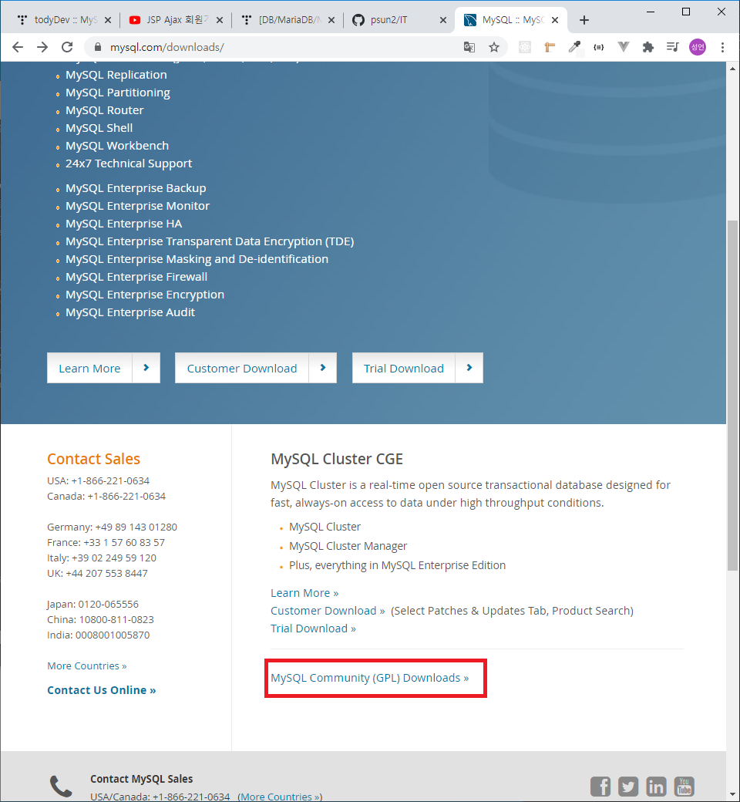
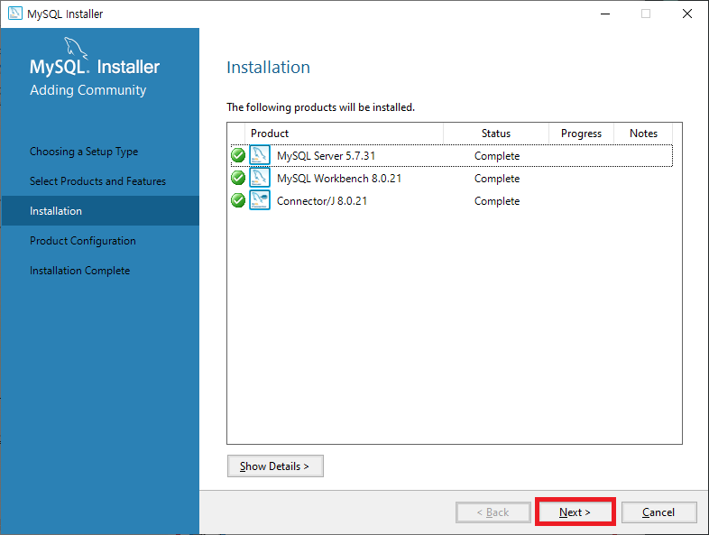
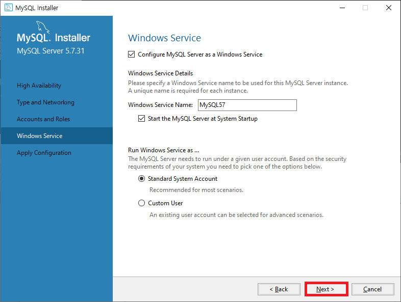

# MySQL

## 다운로드

[mysql 다운로드 url](https://www.mysql.com/downloads/)

Mysql Community (GLP) Downloads 클릭

Mysql Community Server 클릭

Looking for previous GA version? 을 클릭하여 원하는 버전을 찾아 다운 받을수 있도록 합니다.

Install version 설치기 클릭하여 다운로드 받을수 있도록 합니다.

Install version 시 아래 체크된 통합 파일을 받을수 있도독합니다.

Zip 파일 다운로드 시 운영체제에 맞는 것을 다운 받습니다.

No thanks, just start my download. 를 클릭하여 로그인 없이 다운로드 할 수 있습니다.

---

## 커넥터 다운로드 - 자바와 연동하는 jar (library)

[mysql 커넥터다운로드 url](https://dev.mysql.com/downloads/connector/j/5.1.html)

커넥터 또한 서버의 버전에 호환하는 커넥터를 다운받을수 있도록 합니다.

---

## 설치

각각의 용도에 따라 설치를 할 수 있습니다. 저는 교육적인 용도로 사용하기 때문에 Custom으로 필요한 부분만 설치 할 수 있도록 하겠습니다.

운영체제에 맞는 server을 설치 할 수 있도록 합니다.

필수는 아니나 있으면 좋은 기능인 MySQL Workbench (Oracle 의 sqldeveloper 와 같은 기능.) 도 설치 할 수 있도록 합니다.

Connector까지 총 3가지 파일을 설치 할 수 있도록 합니다.

처음 설치시 하이라이팅 된 파일중 한 두 가지 정도가 없을 수 있습니다.  
하나 하나 클릭하여 Execute 할 수 있도록 합니다.

Execute 하여 설치를 진행 하도록 합니다.

Next 를 눌러 진행합니다.

Next 를 눌러 진행합니다.

Next 를 눌러 진행합니다.

Next 를 눌러 진행합니다.

해당 데이터베이스의 root 비밀번호를 설정한뒤 Next 를 눌러 진행합니다.

Next 를 눌러 진행합니다.

Execute 를 통해 전부 설치 할 수 있도록 합니다.

Finish를 눌러 설치를 완료 합니다.

---

## Encoding 설정

my.ini 파일을 수정 하여 인코딩 설정을 할 수 있습니다.

my.ini 파일 경로 : C:\ProgramData\MySQL\MySQL Server 5.7

ProgramData 폴더는 숨김 폴더이므로, 숨김폴더 를 볼 수 있게 설정을 하여야합니다.

설정 변경을 위하여 간단하게 메모장으로 열 수 있도록 합니다.

 #제거후 utf8 인코딩 설정을 합니다.

 #을 제거합니다.

 #제거후 utf8 인코딩 설정을 합니다.

서비스로 들어와 서버를 재시작 해준뒤, 사용합니다.
