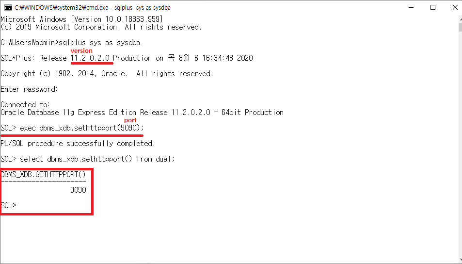

# Oracle_Port변경 및 버전 출력

## CMD

## 버전출력 및 sql 접속

```
sqlplus sys as sysdba
```

이후 system 계정의 비밀번호를 입력후 진입

```
EXEC DBMS_XDB.SETHTTPPORT(사용할 포트번호);
```

successfully 출력시 포트번호가 성공적으로 바뀝니다.
이후 바뀐 포트 번호를 출력할시

```
SELECT DBMS_XDB.GETHTTPPORT() FROM DUAL;
```

을 입력하여 바뀐 포트번호를 출력합니다.  

