# Oracle

## 교육용 down

[교육용down 링크](https://www.oracle.com/database/technologies/xe-prior-releases.html)

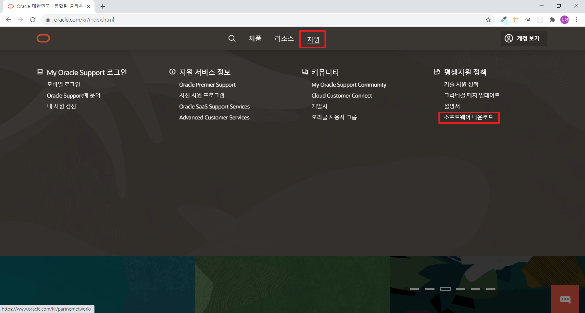
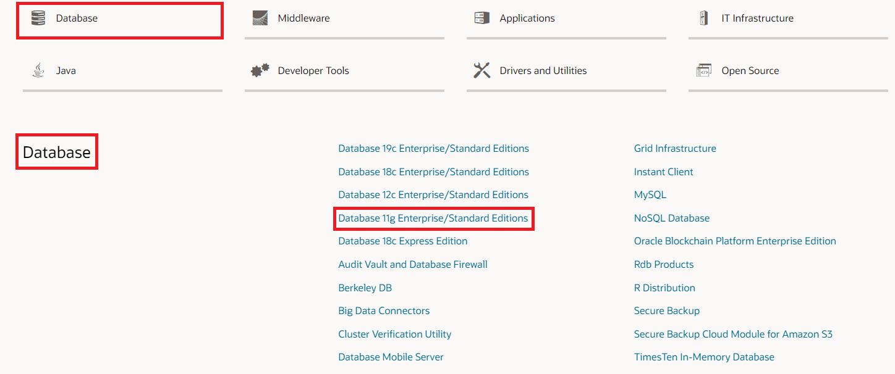
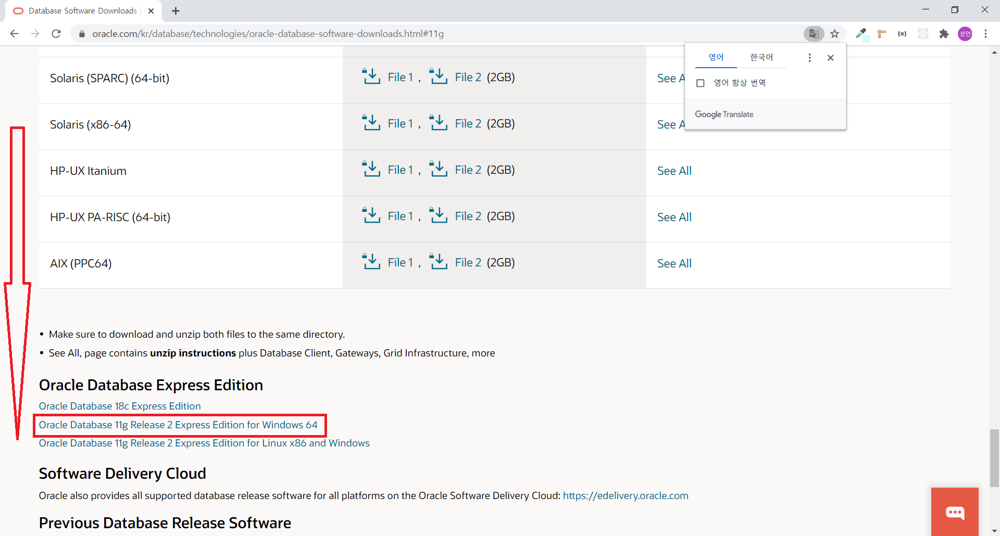
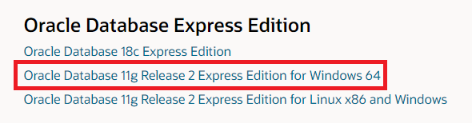

출처 : https://www.oracle.com/database/technologies/xe-prior-releases.html

---

## JDK경로 변경

경로가 맞지 않으면 자바와 연동시 Error이 발생하기 때문에 꼭 JDK경로를 확인 해 주시기 바랍니다.
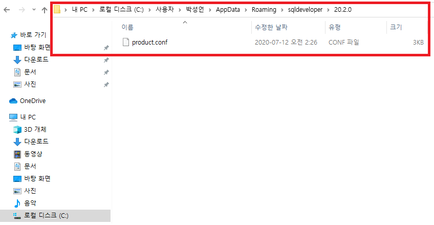
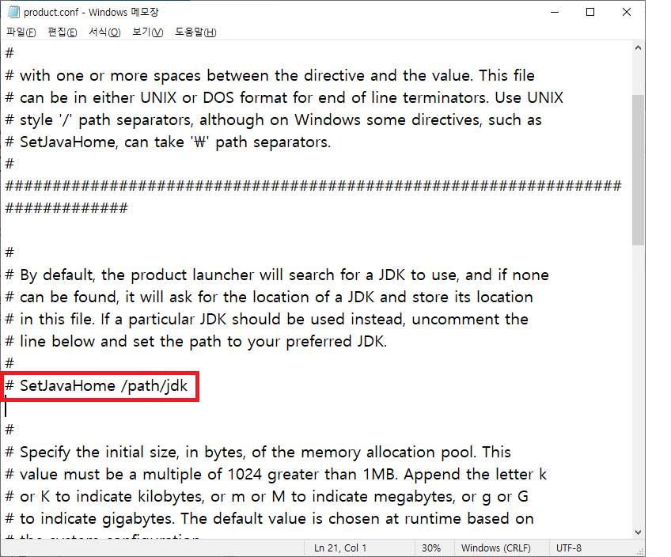
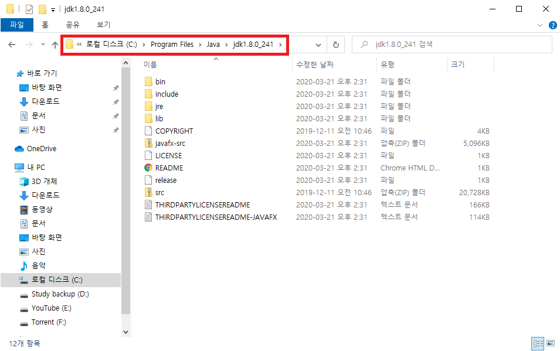
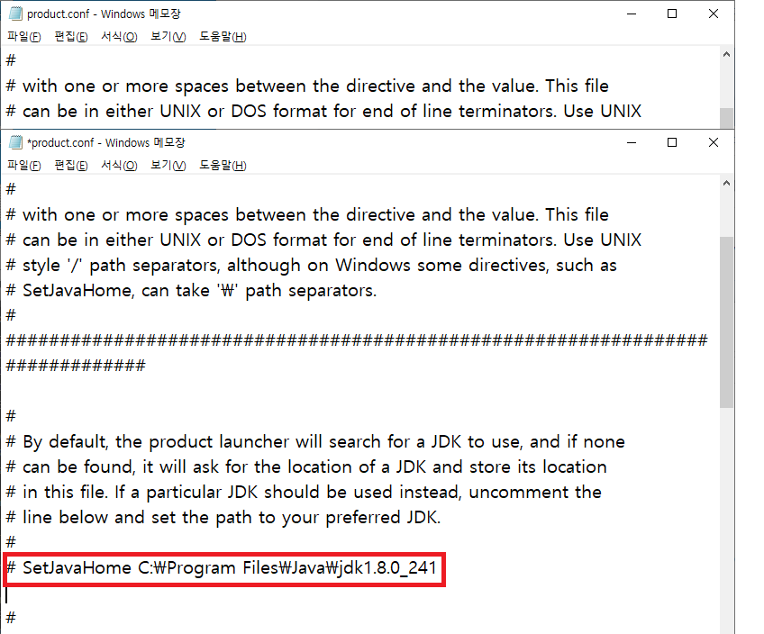

---

## Oracle 설정

본 과정은 교육용 hr 계정의 lock을 해제 하는 과정 입니다.
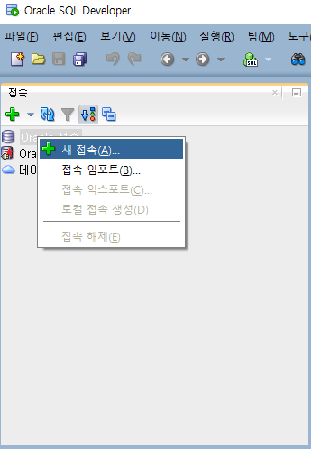
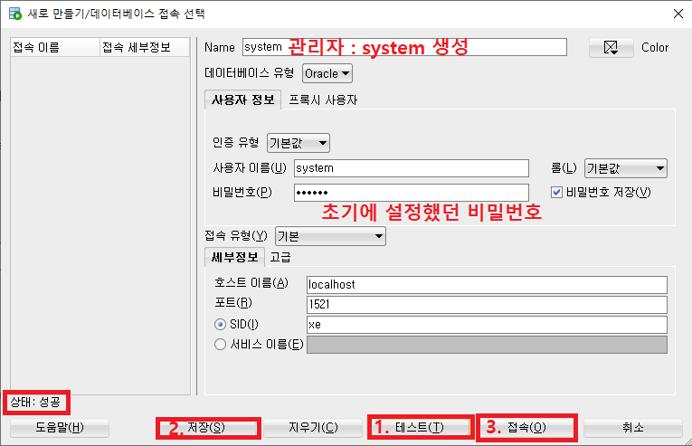
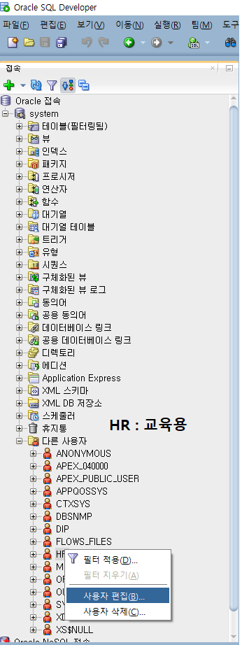
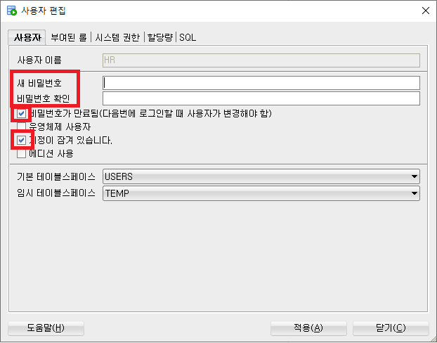
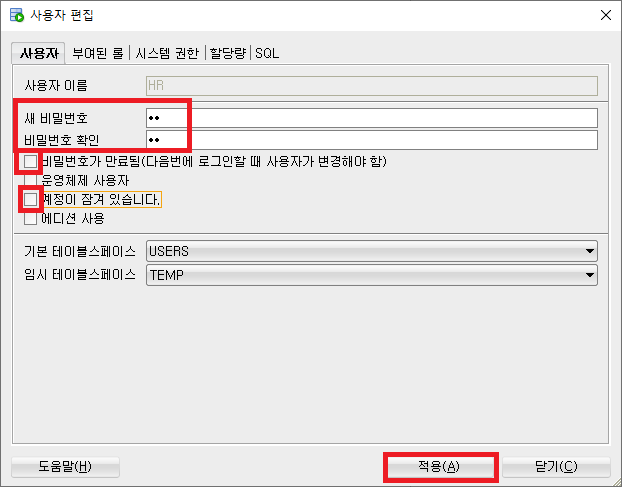
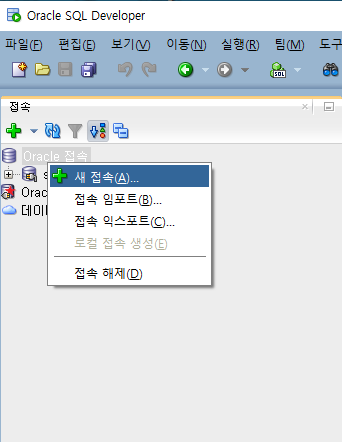
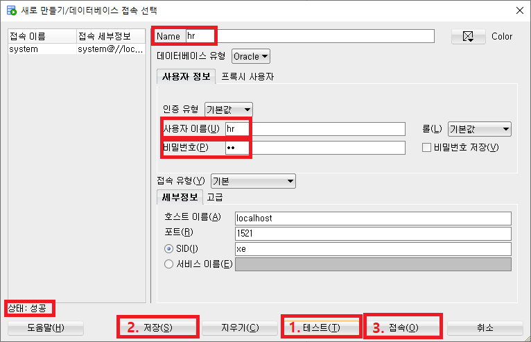

---

## JAVA 와 연동

connect 의 library 를 찾아 자바와 연동 을 하셔야 자바에서 oracle 사용이 가능합니다.
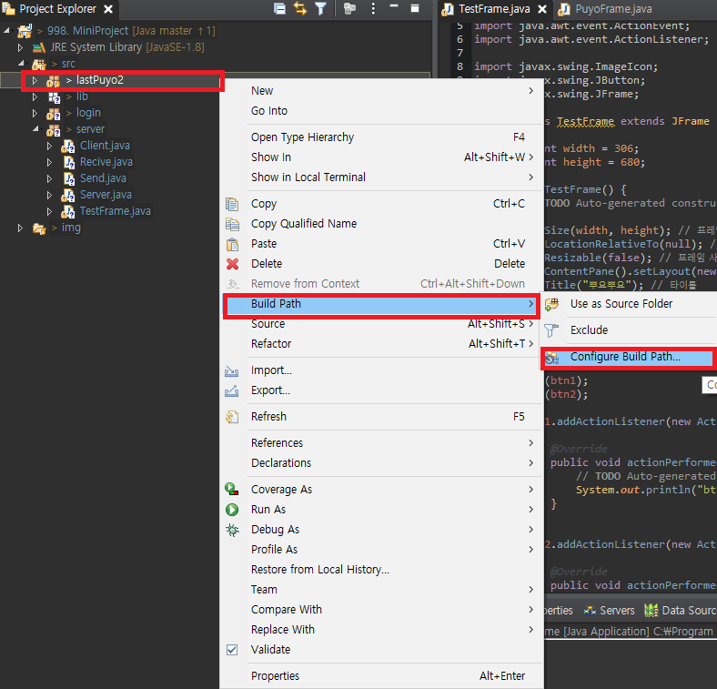
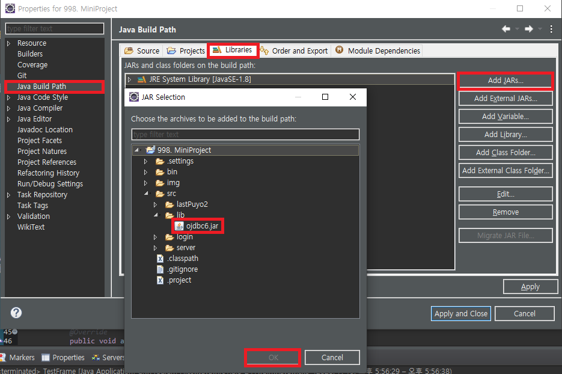
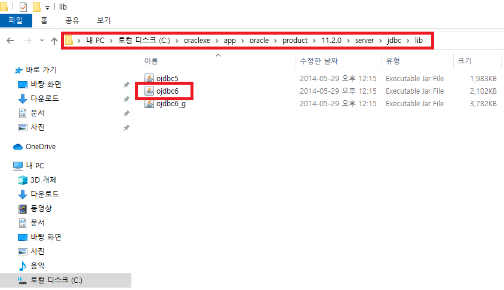

```
"jdbc:oracle:thin:@localhost:1521:xe";
```

위와 같은 문장으로 Connection을 연결하여 사용 합니다.
