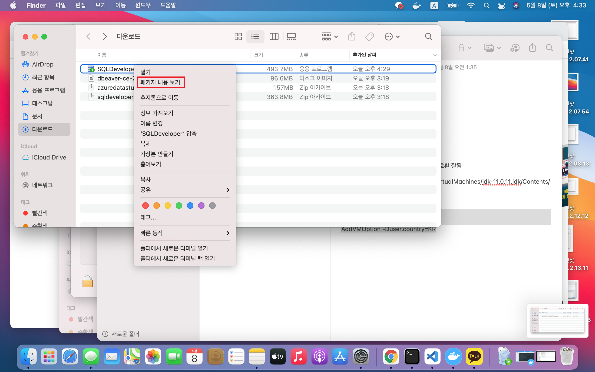
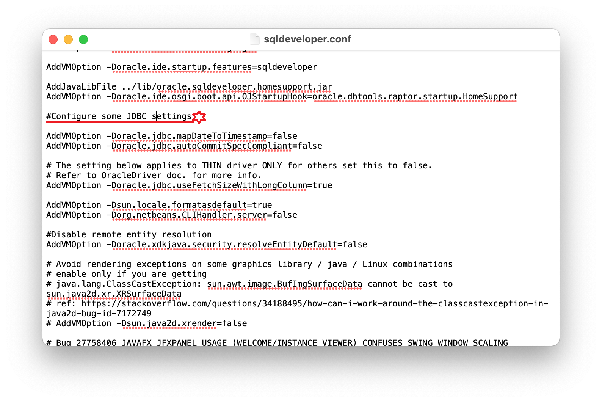
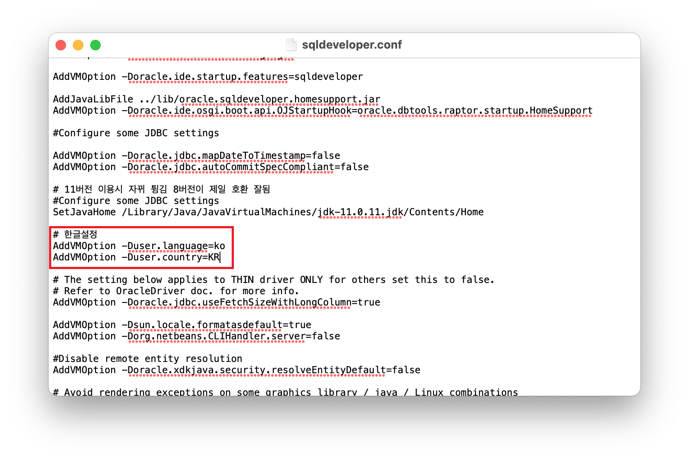

# `SQLDeveloper`

[오라클](https://www.oracle.com/kr/index.html)  
[오라클 다운로드](https://www.oracle.com/kr/downloads/)

## `SQLDeveloper JDK 버전 변경`

  


```
Contents/Resoureces/sqldeveloper/sqldeveloper/bin
```

  
  


```
#호환 버전 관계없음
#Configure some JDBC Settings

/Library/Java/JavaVirtualMachines/jdk-11.0.11.jdk/Contents/Home
```



```
#한글설정

AddVMOption -Duser.language=ko
AddVMOption -Duser.country=KR
```

  

