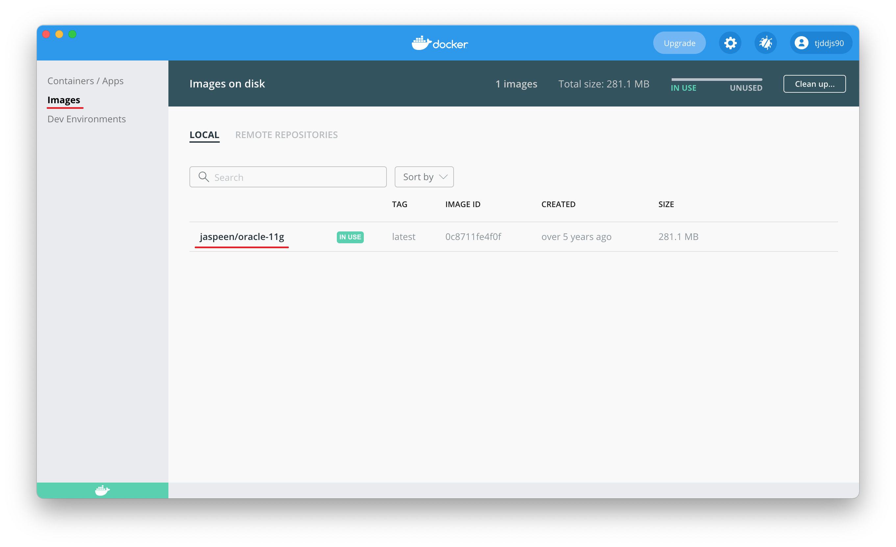

# `Oracle`

[오라클](https://www.oracle.com/kr/index.html)  
[오라클 다운로드](https://www.oracle.com/kr/downloads/)

## `Oracle_DataBase`

mac os 에서 oracle_database를 이용 하려면 먼저 아래 주소에서 docker을 다운로드 할 수 있도록 합니다.

[docker](https://www.docker.com/)  
[download](https://www.docker.com/get-started)


```
$ docker search oracle-xe-11g
```

> 도커 허브에 등록되어있는 image를 찾습니다.


```
$ docker pull jaspeen/oracle-11g
```

> 도커 허브에 등록되어있는 image를 local로 다운 받습니다.


```
$ docker images
```

> local에 있는 image파일들을 확인 합니다.



> GUI로 보아도 잘 등록 되어 있습니다.


```
$ docker run --name oracle11g -d -p 9090:9090 -p 1521:1521 jaspeen/oracle-11g
```

> 오라클의 기본 포트번호는 8080이지만 tomcat과 겹칠 것을 생각하여 9090으로 잡아 주었습니다.  
> 이미지를 container로 만드는 작업을 한뒤 start를 합니다.


```
$ docker ps -a
```

> 현재 local에 등록된 모든 container를 확인합니다.(-a 옵션이 없을땐 동작중인 container)


> GUI로 보아도 잘 등록 되어 있습니다.


```
$ docker stop
$ docker start
```

> 이미지를 실행, 정지 합니다.

---
