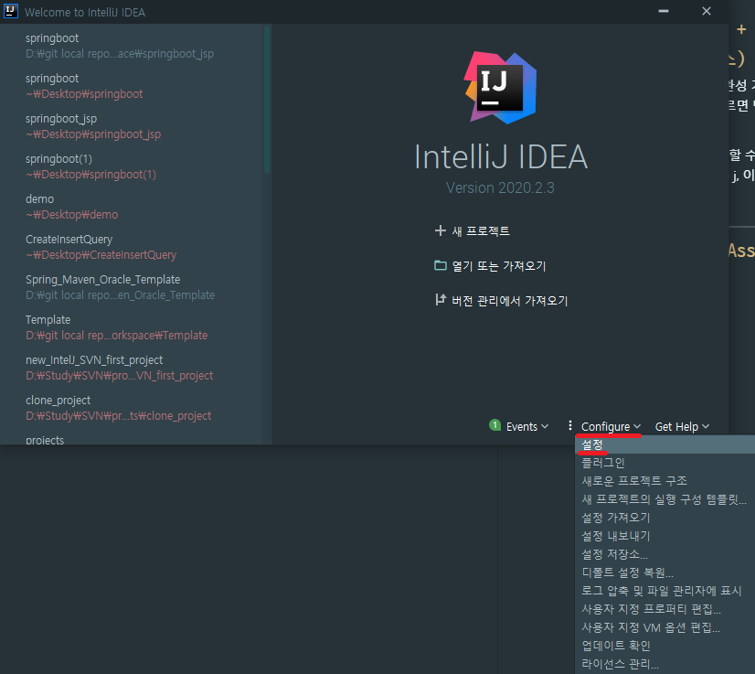
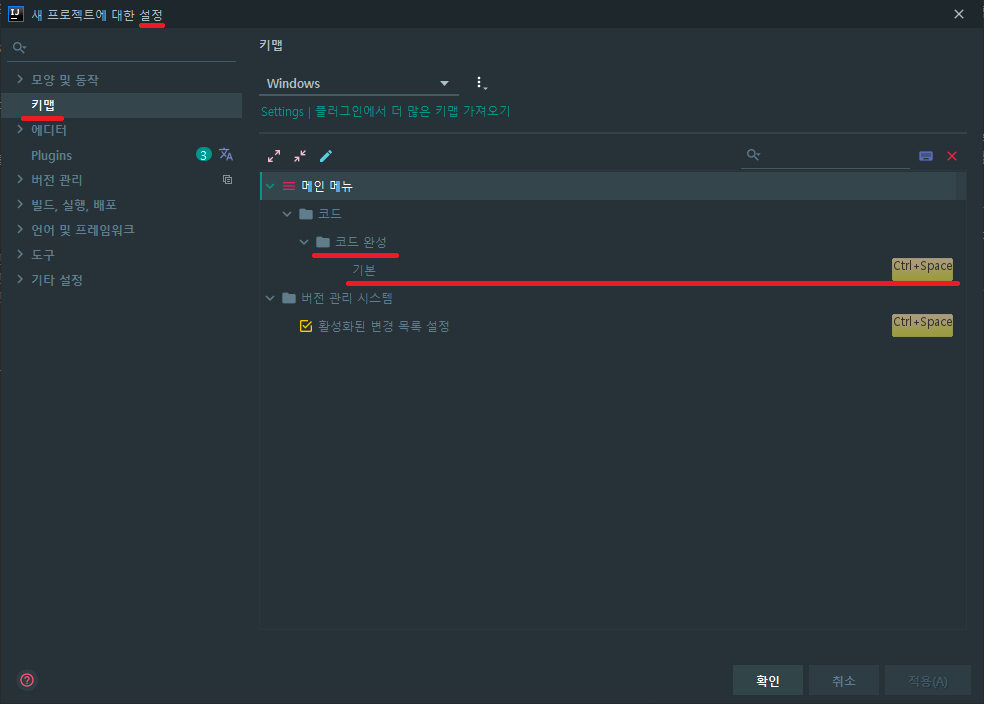
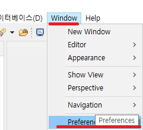
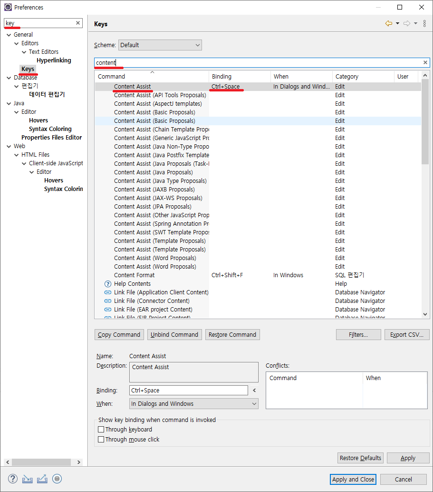
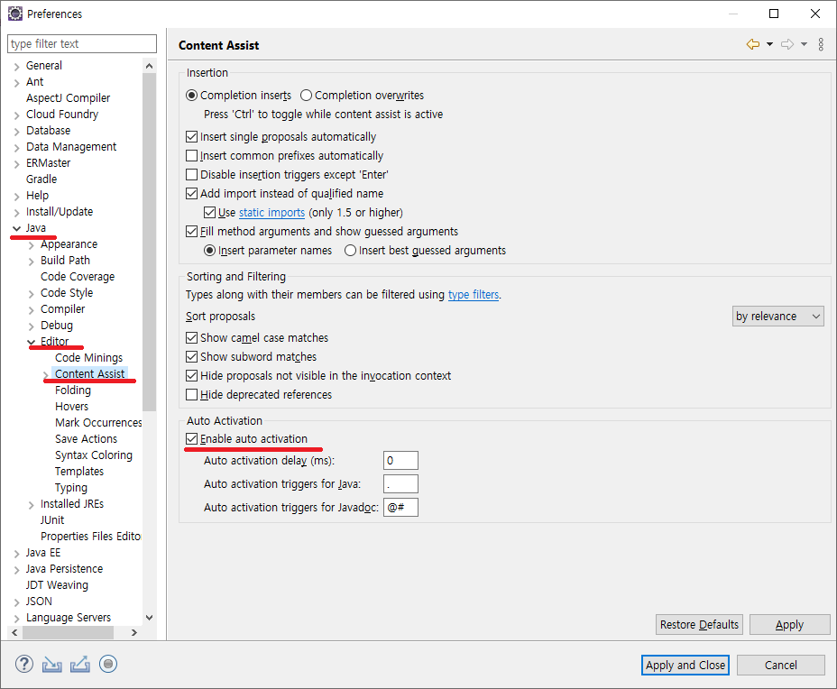
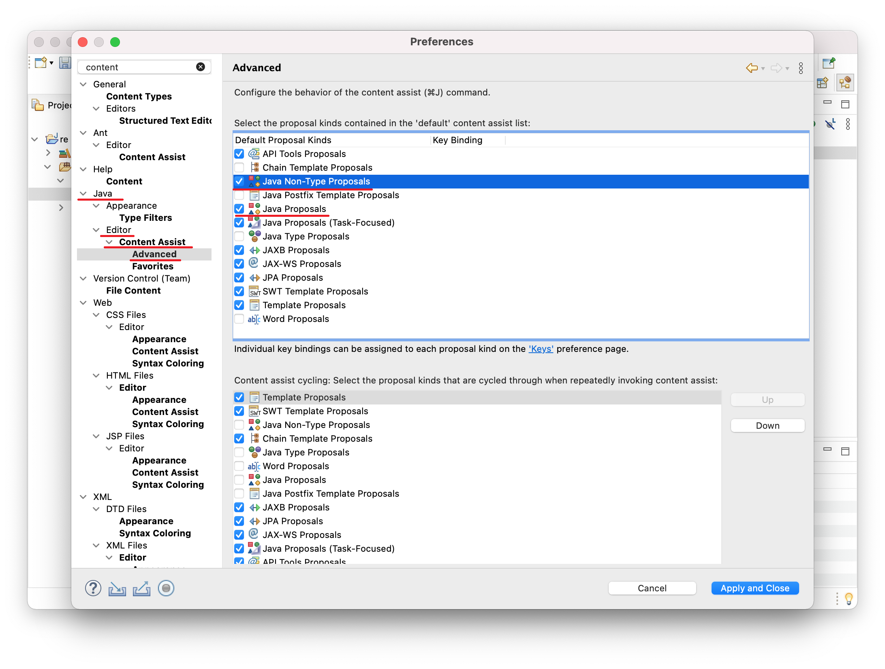
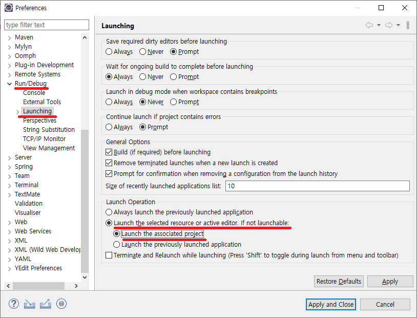

# `IDE`

현재 사용중인 java ide 는 인텔리제이 와 이클립스를 사용중인데,
인텔리제이는 오류없이 잘 돌아가고 이클립스의 오류에 대해 해결해 볼까 합니다.

## `Content Assist(ctrl + command + space) 자동완성 단축키 변경(fate. 인텔리제이, 이클립스)`

맥에서 content assist 이하 자동완성 기능의 key는 window와 마찬가지로 ctrl + space 입니다.  
하지만 맥에서 ctrl + space를 누르면 맥os의 검색창인 spotlight(스포트라이트)가 나와서 이클립스의 단축키가 작동되지 않습니다.

이를 위해 먼저 단축키의 변경을 할 수 있도록 합니다.  
(필자는 인텔리제이: command + j, 이클립스: ctrl + command + space)를 이용하고 있습니다.

> InteliJ

> Eclipse

---

## `이클립스 - Content Assist(ctrl + command + space) 자동완성 오류`

mac os 에서 처음 이클립스를 깔아보셧다면 당황하실만 한 이유가  
자동완성 기능이 적용되지 않습니다.  
기본적으로 mac에서는 이 기능을 꺼두었기 때문입니다.  
자동완성 즉 contant assist 를 활성화 하는 방법을 알아보도록 하겠습니다.

  
Auto Activration 탭의
Enable auto activation이 체크가 되어있는지 확인합니다.  
만약 체크가 되어있는데 안된다면 다음 단계로 이동합니다.

Advenced 탭의
Java Proposals 와 Java Non-Type-Proposals의 체크 유무를 확인뒤 체크를 해주시면  
오류가 해결 됩니다.

---

## `The selection cannot be launched and there are no recent launches 에러`

[참고](https://zxcv5500.tistory.com/268)

해결 방법:

메뉴 창에서

1. Window - > Preferecences 클릭

2. Run/Debug -> Launching 란을 보면

Launch Operation 항목이 있다.

Launch the selected resource or active editor. if not launchable: 항목의 라디오 그룹에서

--> Launch the associated project 를 선택해 준다.

관련된 프로젝트를 시작 시킨다는 의미이고,

아래 항목은 Launch the Previously launched application은 이전에 실행 시켰던 어플리케이션을 시작 시킨다는 의미다.

왜 아래 항목이 default로 잡혀있는지 이해할 수 없다. run 시킬 때마다 이전에 실행했던 어플만 실행한다는 의미인데... 이걸 왜 default로 둔 건가. 이클립스 측의 실수 같다.

