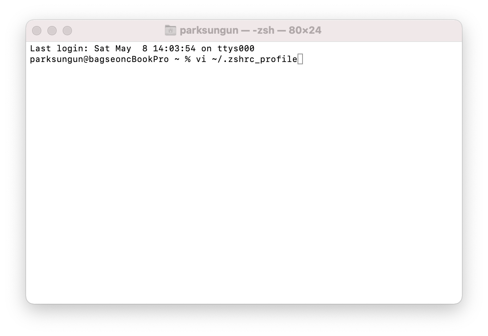
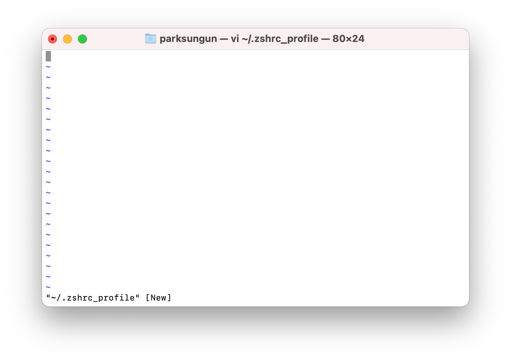
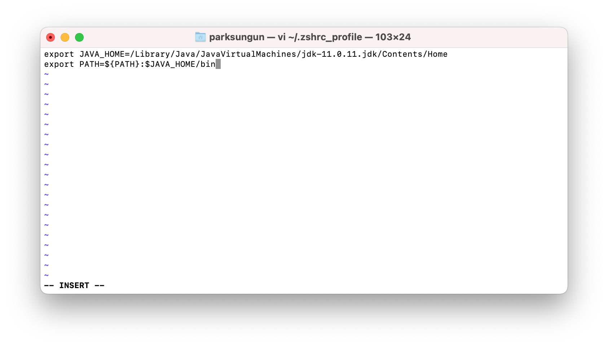
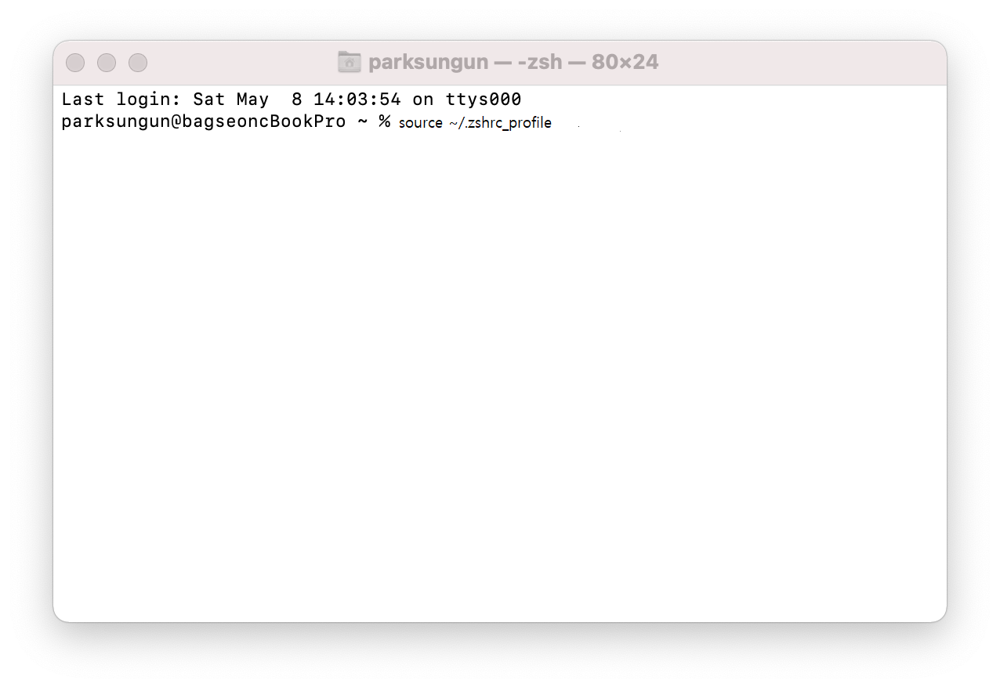

# `JDK`

[오라클](https://www.oracle.com/kr/index.html)  
[오라클 다운로드](https://www.oracle.com/kr/downloads/)

## `JDK 환경변수 설정`



```
$ vi ~/.zshrc_profile
```



> I를 눌러 insert모드 진입


> JDK 주소 복사



```
export JAVA_HOME=${JDK 주소}
export PATH=${PATH}:JAVA_HOME/bin

export JAVA_HOME=/Library/Java/JavaVirtualMachines/jdk-11.0.11.jdk/Contents/Home
export PATH=${PATH}:JAVA_HOME/bin
```

> esc 이후 :wq를 입력하여 저장후 종료 합니다.



```
source ~/.zshrc_profile
```

> 위 명령어를 입력하여 바뀐 환경변수를 fetch 합니다.

---

## `JDK 버전 변경`

  


> JDK 주소 복사


```
export JAVA_HOME=${변경할 JDK 주소}
```

> I를 눌러 insert모드 진입  
> esc 이후 :wq를 입력하여 저장후 종료 합니다.


```
source ~/.zshrc_profile
```

> 위 명령어를 입력하여 바뀐 환경변수를 fetch 합니다.
