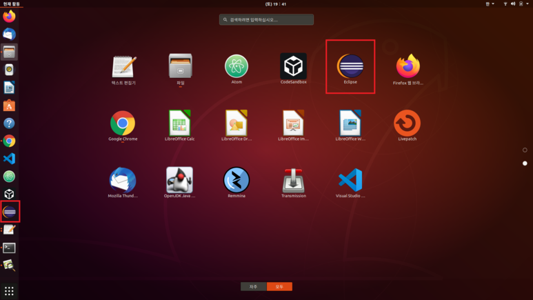
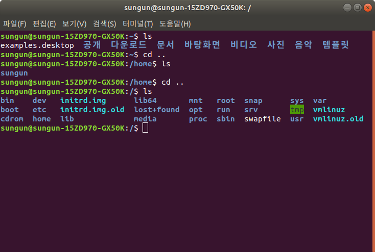
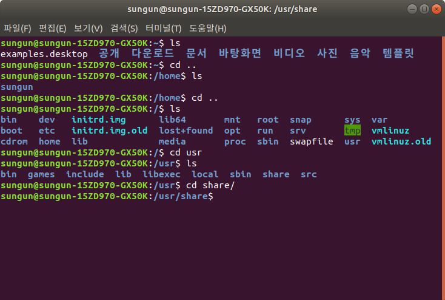
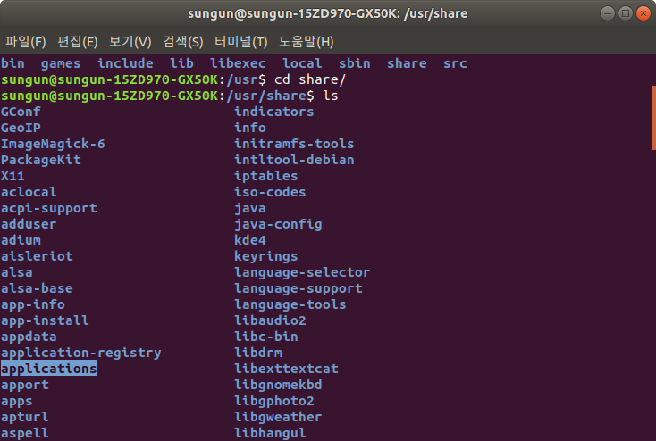
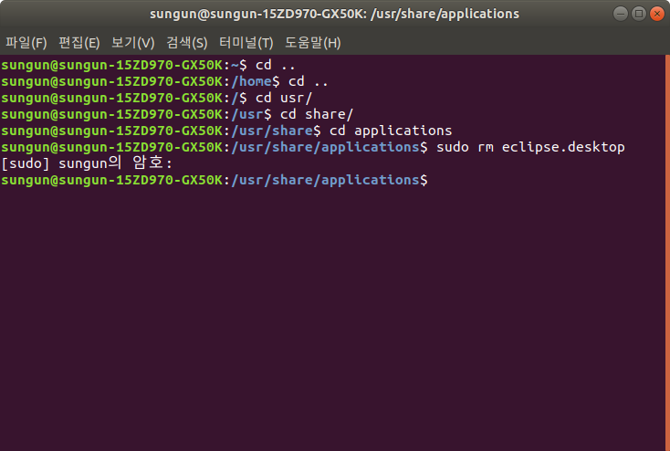
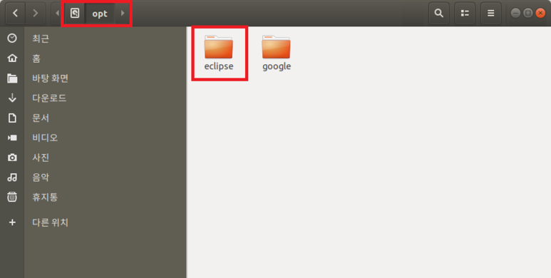
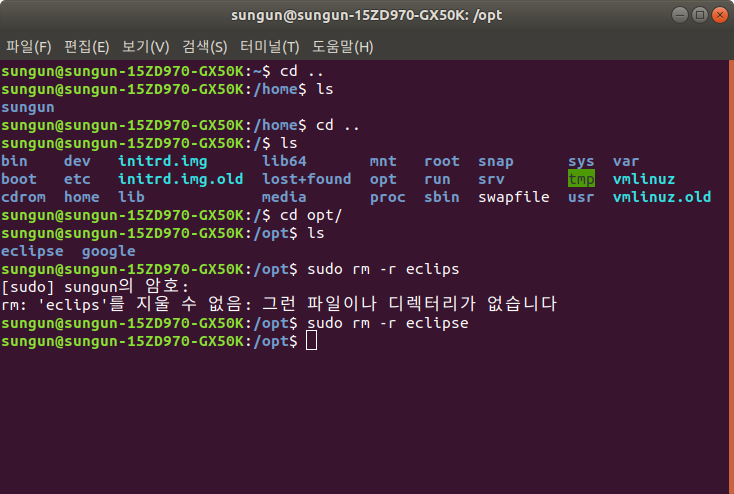
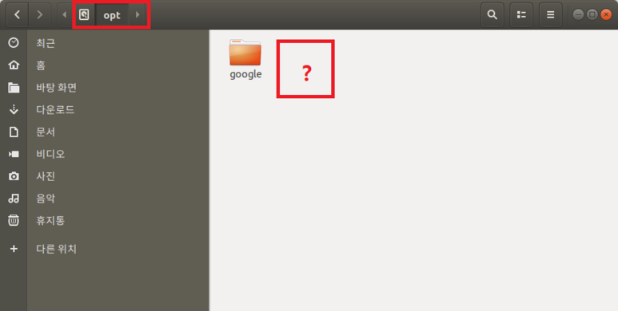

# [Java 개발환경 구축] - ubuntu eclipse (이클립스) 제거

## desk top icon 제거




```
$ cd..
```

```
$ cd..
```



```
$ cd usr
```

```
$ cd share
```




```
$ cd applications
```

```
$ sudo rm eclipse.desktop
```

---

## 이클립스 opt 폴더 디렉토리 삭제




```
$ cd ..
```

```
$ cd ..
```

```
$ cd opt
```

```
$ sudo rm -r eclipse
```

파일이 들어있는 디렉토리 삭제 이므로, rm 명령어에 -r 옵션을 준다.


