# `Ubuntu Eclipse 설치` [](../../자발개발환경구축.md) [](../../자발개발환경구축.md)
   
## `List`  
- 이클립스 다운로드
- 이클립스 설치
- 이클립스 터미널 설정
- 이클립스 바로가기 설정에 대한 권한 설정
- 이클립스 실행 아이콘 생성 및 이클립스 툴바 에 추가

---

>## `이클립스 다운로드`

다운로드 전에 운영체제 아키텍쳐 확인 을 하고 갑니다.

`$ uname -m`

32비트 - i386, i486, i586, i686, x86

64비트 - amd64, x86_64

[Download - Eclipse](https://www.eclipse.org/downloads/)

원하시는 패키지를 찾아 다운로드 합니다.

---
>## `이클립스 설치`

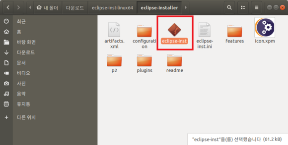  

eclipse-inst 파일을 실행 시켜 줍니다.

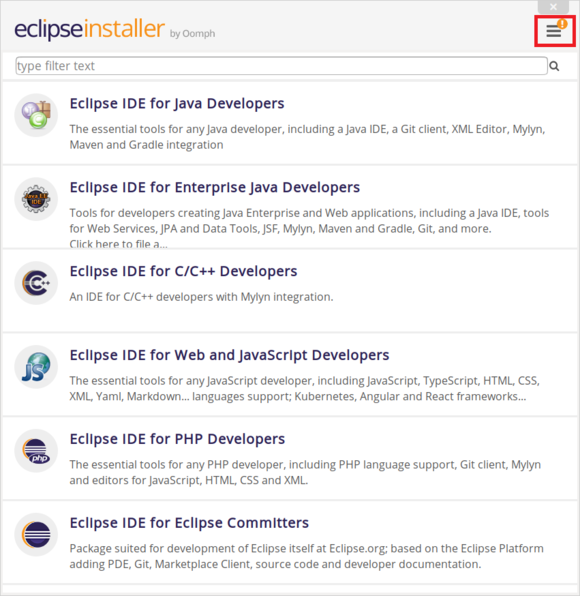  
  
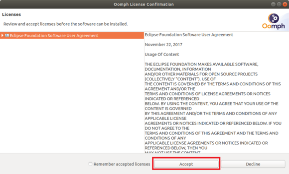  

installer 의 우측 상단에 ! (느낌표)가 표시된 것은 업데이트가 있다는 의미이니, 업데이트 먼저 받고 진행 해 주시면 되겠습니다.

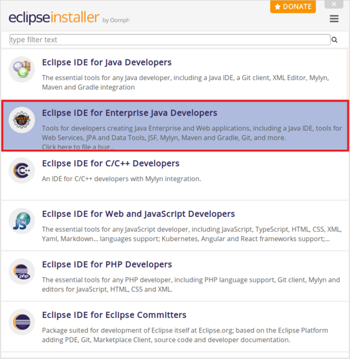  

사진과 같이 클릭 클릭으로 설치를 진행 해주시면 되겠습니다.

---

>## `이클립스 터미널 설정`

터미널로 이클립스를 실행하지 않으므로, 

간단한 설명, 명령어와 함께 이단계는 패스 하겠습니다.

`$ sudo vi /usr/bin/eclipse (CUI를 사용하는 vi 사용)`

`$ sudo gedit /usr/bin/eclipse (GUI를 사용하는 gedit 사용)`

<br/>

`#! /bin/sh`

`export ECLIPSE_HOME=/opt/eclipse`

`$ ECLIPSE_HOME/eclipse $*`

---

>## `이클립스 바로가기 설정에 대한 권한 설정`

`$ sudo chmod 755 /usr/bin/eclipse`

---

>## `이클립스 실행 아이콘 생성 및 이클립스 툴바 에 추가 `

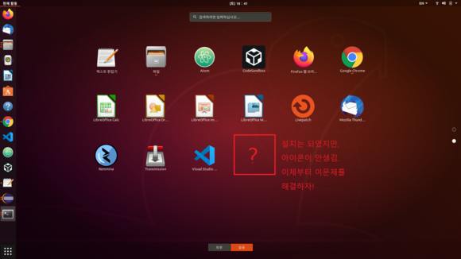  

사진에 보시는 것과 같이 설치는 했지만 아이콘이 안생기는 특이한 일이 벌어집니다.  

그럼 이제 아이콘을 만들어 보아야겠어요!!  

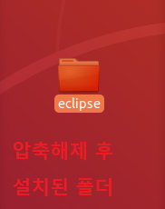
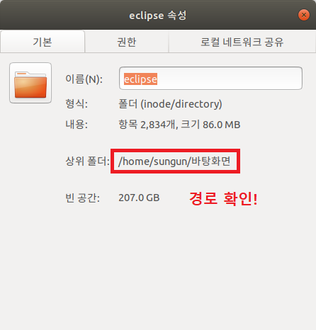
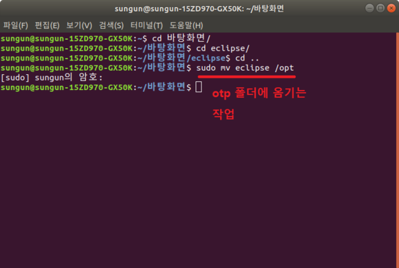

먼저 설치를 진행하면 eclipse의 폴더 하나가 생성 될 것입니다.   

그 폴더에 우클릭을 하여 경로를 확인 하여 주시기 바랍니다.  

​

그 다음 터미널을 실행해주세요. 설치된 파일의 경로까지 갑니다.  

그리고 관리자 권한을 부여하여 otp 폴더에 이동시켜주시면 되겠습니다.  


`$ sudo mv eclipse /opt`

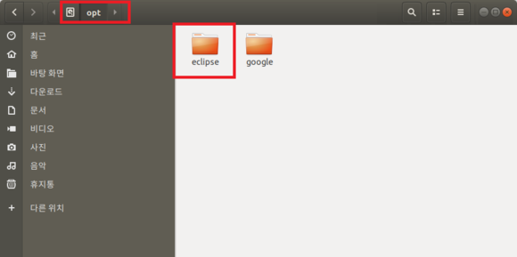  

자 이제 opt폴더에 eclipse 폴더가 잘 들어 왔네요.  

다음 작업 툴바에 추가해주기 위하여, 다음 명령어를 진행 시킵니다.  

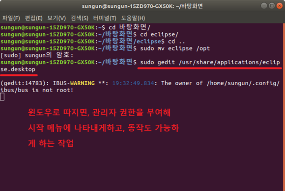  
 
`$ sudo vi /usr/share/applications/eclipse.desktop (vi 사용)`  

`$ sudo gedit /usr/share/applications/eclipse.desktop (gedit 사용)`  

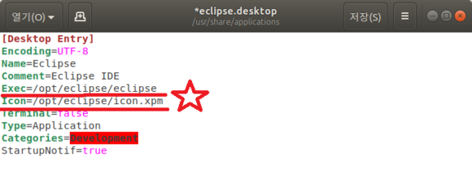  

```
[Desktop Entry]
Encoding=UTF-8
Name=Eclipse
Comment=Eclipse IDE
Exec=이클립스 경로 설정!
Icon=이클립스 아이콘 경로 설정!
Terminal=false
Type=Application
Categories=Development
StartupNotif=true
```

명령어가 잘 진행되었으면, 처음에는 빈 메모장이 실행되고 위와 같은 코드를 작성시켜주면 되겠습니다.

여기서 주의 할점은 Exec 와 Icon 은 본인의 경로에 맞게 작성 해주셔야 합니다.

설치 완료!!

---
[](../../자발개발환경구축.md) 
[](../../자발개발환경구축.md)
   