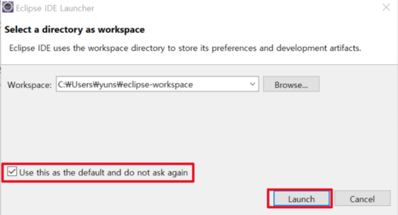
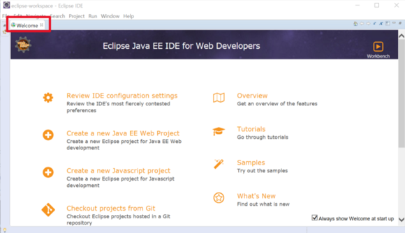
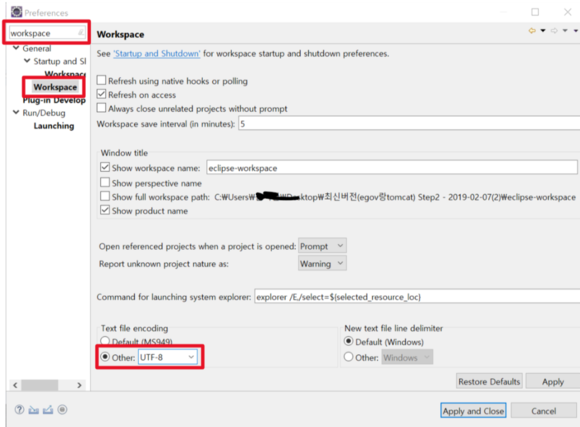
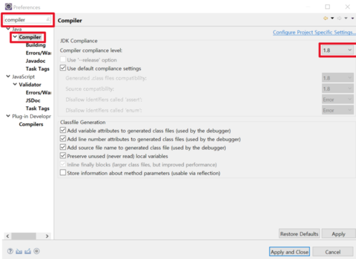

# `Window Eclipse 설치`  
   
>## `Eclipse 설치`

2020 - 03 -22 현재 window에서 이클립스 인스톨.exe로 진행시  

jdk 가 설치 되있음에도 불구하고, 계속 jdk 를 요구 합니다.  

​

설치 파일은 exe 가 아닌  압축 zip파일을 받아 압축 해제후 사용하시면 되겠습니다.  

​

아래 링크는 이클립스를 다운 받을 수 있는 사이트입니다.  

 

https://www.eclipse.org/downloads/  

 

이클립스 자신의 운영체제에 맞는 버전을 클릭 하여 다운로드 합니다.  

    

체크박스를 체크하고 Launch를 클릭합니다.  

  

이클립스가 설치되면 이런 화면이 뜨는데 환영인사 같은 것이므로 그냥 닫기를 클릭합니다.   
하얀 화면이 이클립스의 메인 화면입니다.   
설정을 하기 위해 window탭에 preferences를 클릭합니다.  

  

검색창에 workspace라고 치고 맨 아래에 있는 workspace를 클릭하면 창이 이렇게 바뀝니다.   
그러면 맨 아래에 있는 other를 체크하고 UTF-8로 바꾸어 준 다음 Apply를 클릭합니다.  
이렇게 설정해야 소스에서 한글을 인식할 수 있습니다.  

 

그런 다음 다시 검색창에서 compiler라고 치고 클릭해서   
compiler compliance level을 1.8로 바꾸어 주고 Apply를 클릭해줍니다.   
이로써 이클립스를 정상적으로 사용할 수 있게 되었습니다.  

---

 

   