# builder 설치

## down

[빌더 다운로드](http://www.eclipse.org/windowbuilder/download.php)
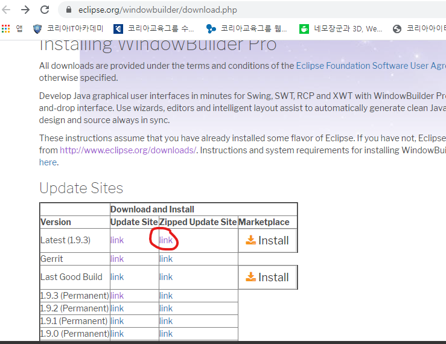  
출처 : http://www.eclipse.org/windowbuilder/download.php

---

## 압축해제

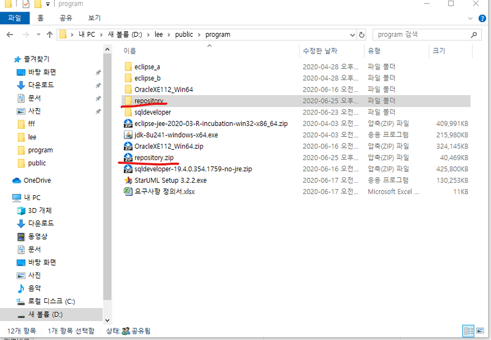

---

## 이클리스와 연동

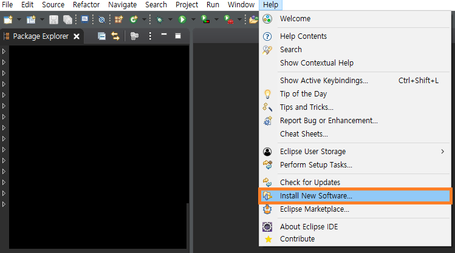
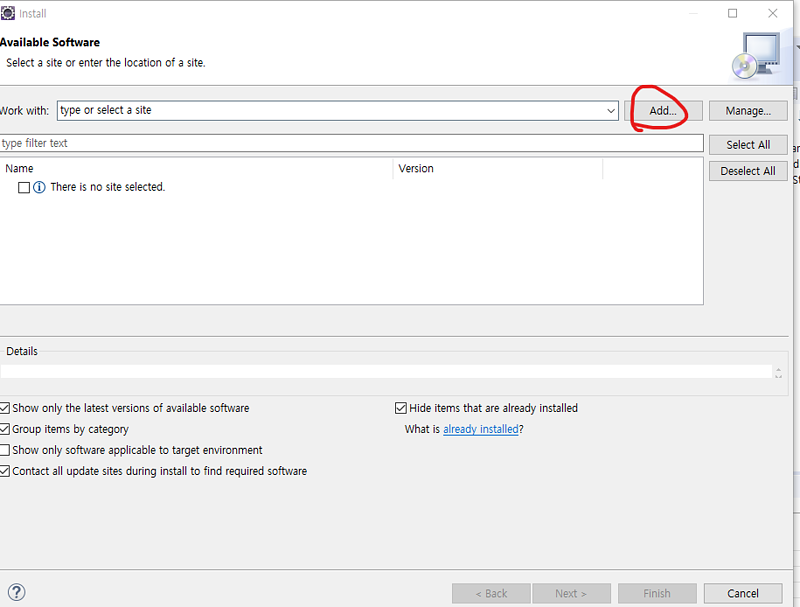
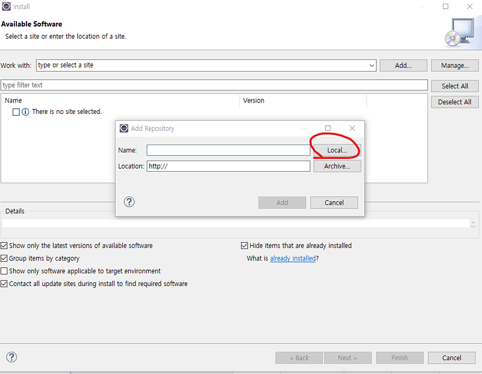
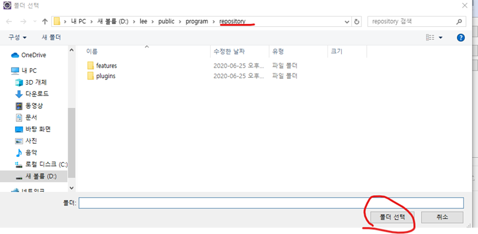
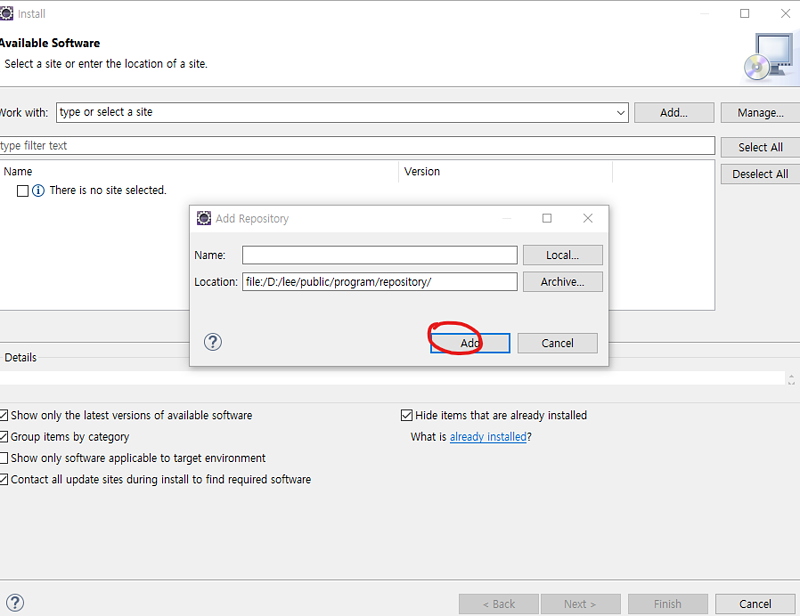
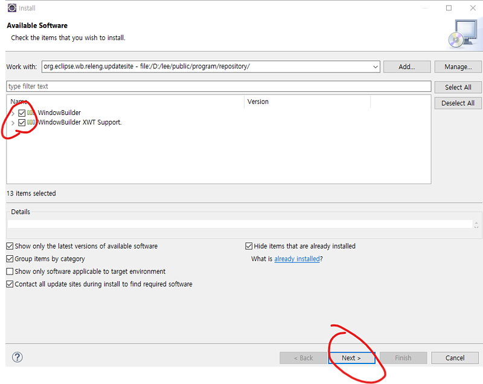
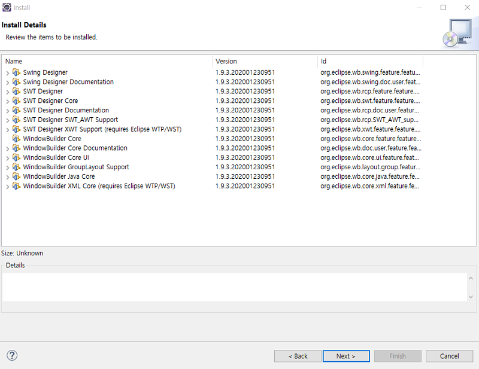
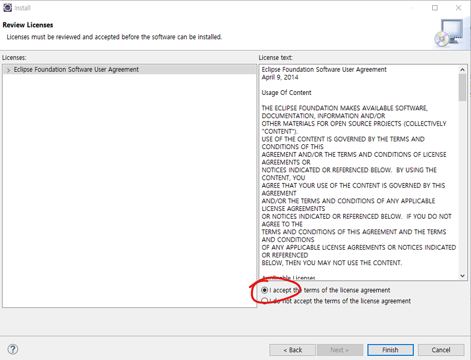
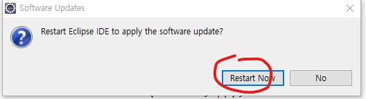
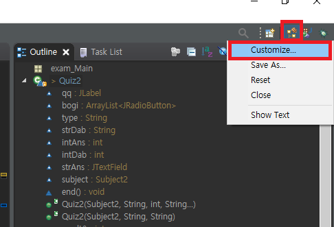
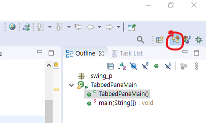
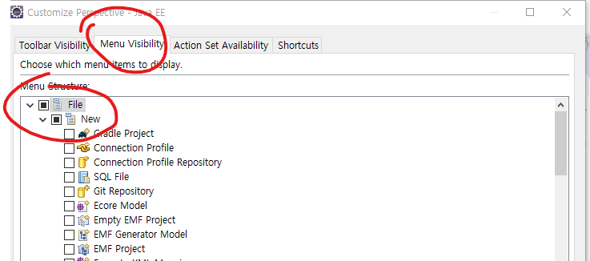
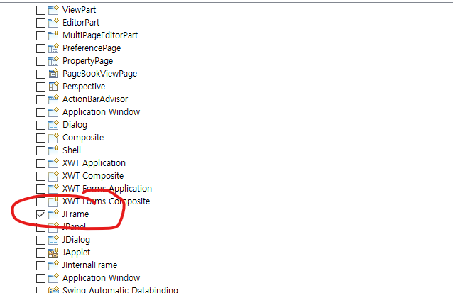

---

## bulider 클래스 생성

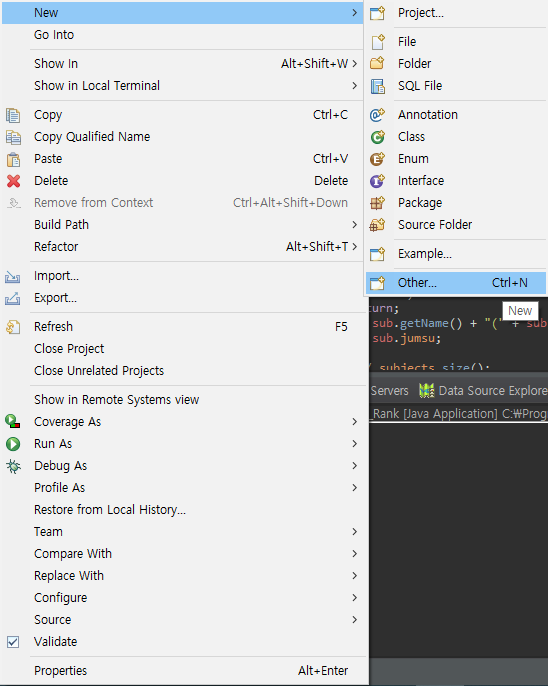
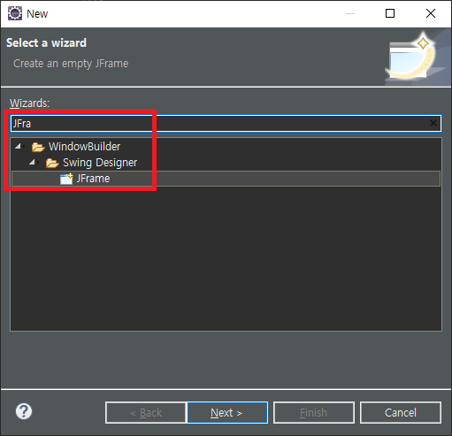
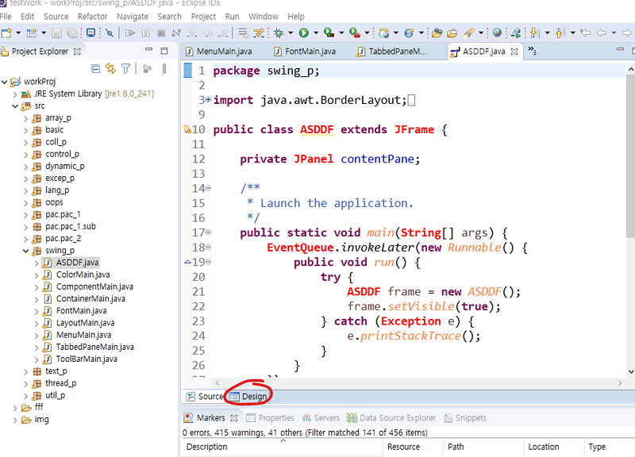
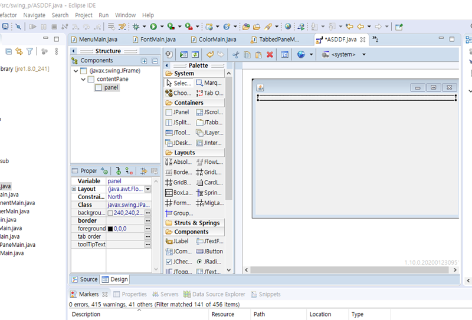

---

## bulider Editor 설정

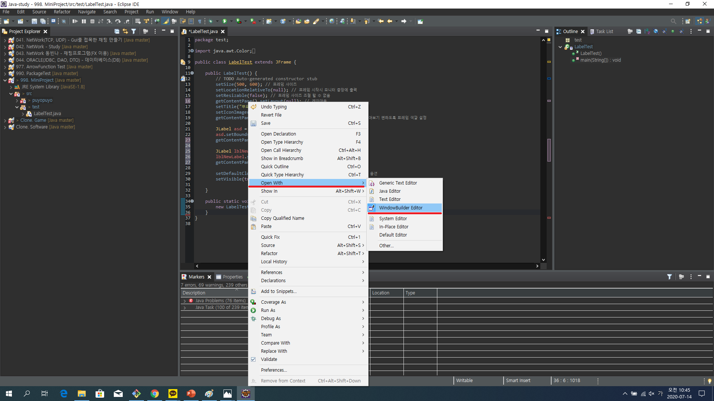
