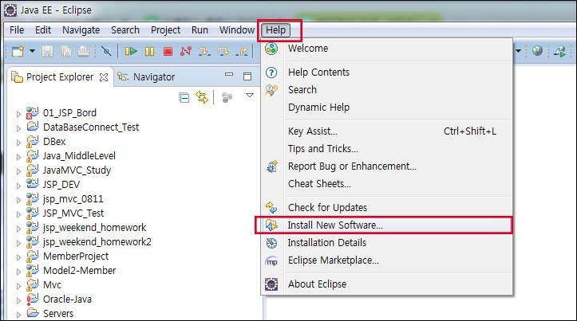
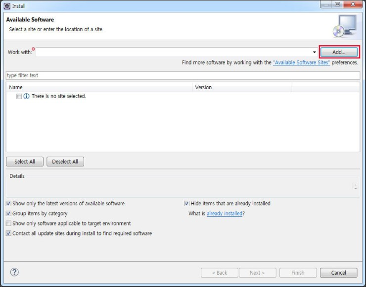
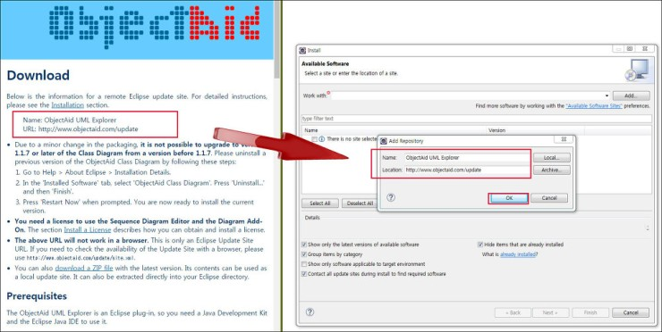
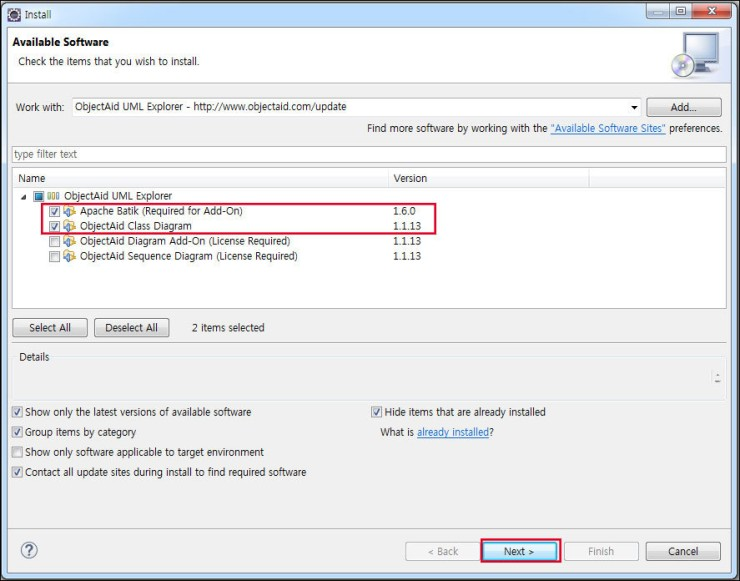
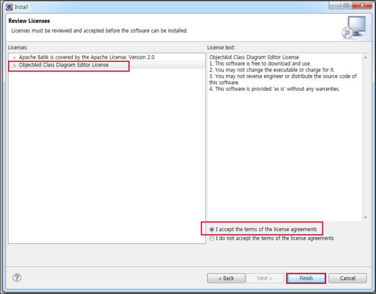
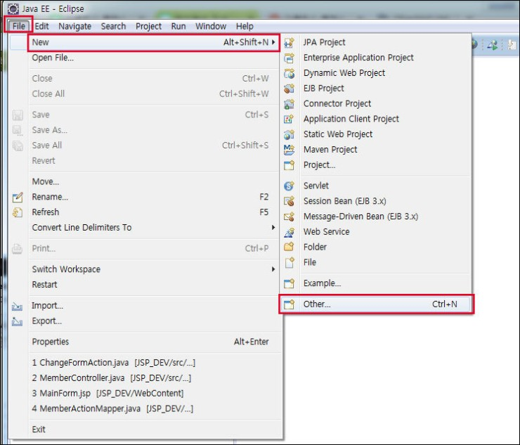
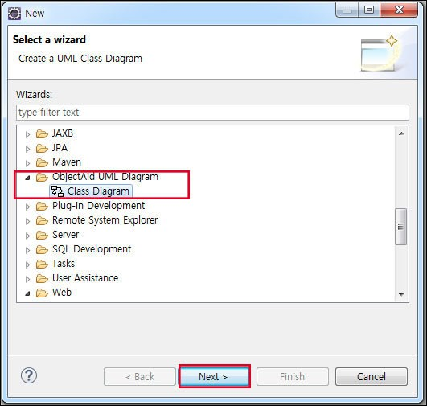
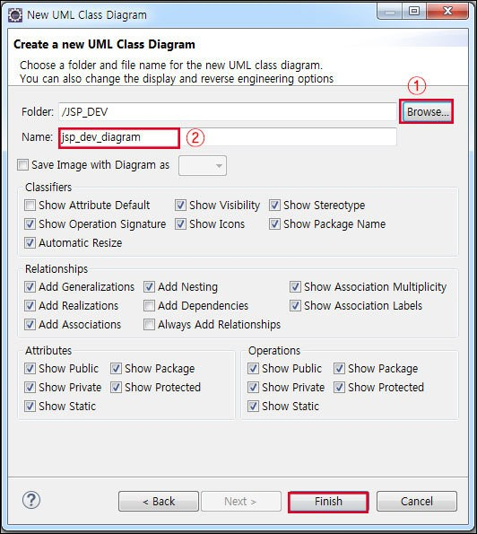
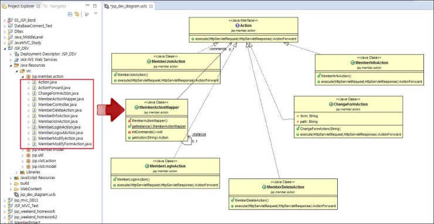
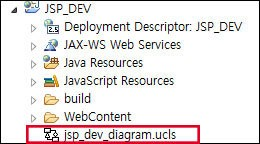

# 클래스다이어그램

이클립스에서 클래스 다이어그램을 생성할 수 있는 ObjectAid라는 플러그인이 있다. 설치하고 나면 프로젝트의 java 파일들을 드래그&드롭 하는 것으로 간단하게 클래스들의 관계도가 만들어지므로 편리하다.

---

## ObjectAid 플러그인 설치

이클립스를 실행시킨 뒤 [Help] - [Install New Software] 메뉴를 선택합니다.

그러면 Install 화면이 나타납니다.  
여기서 Add를 클릭합니다.

ObjectAid : http://www.objectaid.com/download

Name : ObjectAid UML Explorer

Location : http://www.objectaid.com/update/current

다음으로 위의 주소로 ObjectAid 사이트에 들어갑니다.  
여기에 보면 Download 아래에 Name와 URL이 있습니다.  
이것을 Add Repository 창에 각각 입력하고 OK를 클릭합니다.

그러면 Install 화면에 위와 같이 나타날 것입니다.  
여기서 라이센스를 요구하지 않는 위의 2개 항목만 체크를 하고 Next를 클릭합니다.

Review Licenses에서는 아래의 ObjectAid Class Diagram Editor License를 클릭하고 우측에 동의에 체크합니다.  
그리고 Finish를 클릭합니다.

---

## 클래스다이어그램 생성

상단에 있는 [File] - [New] - [Other]을 클릭합니다. (단축키 Ctrl+N )

새로 나타난 창에서 ObjectAid UML Diagram을 찾습니다.  
그리고 하위 메뉴인 Class Diagram을 클릭하고 Next를 누릅니다.

UML Class Diagram 창이 나타납니다.  
여기서 먼저 Browse 버튼을 클릭하여 클래스 다이어그램을 만들 프로젝트를 선택합니다. 다음으로 클래스다 이어그램의 이름을 입력하고 Finish를 클릭합니다.

위에서 지정한 프로젝트를 보면 클래스 다이어그램 파일이 생성되어있습니다.  
여기서 클래스 다이어그램을 만들려면 이것을 더블클릭합니다.

파일을 더블클릭 후 프로젝트에서 Java 파일들을 드래그&드롭 합니다.  
그러면 클래스들의 관계가 자동으로 그려집니다.  
여기서 다른 옵션들을 사용하려면 마우스 우클릭을 하면 됩니다.

---

출처: http://all-record.tistory.com/128 [세상의 모든 기록]
