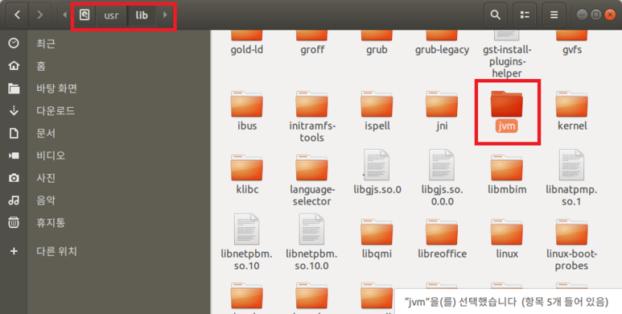
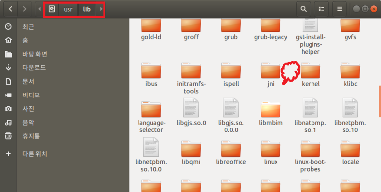

# [Java 개발환경 구축] - ubuntu JAVA(JDK) 제거



---

## openJDK-java 시리즈

### `시리즈 전체 삭제`

```
$ sudo apt remove openjdk*
```

```
apt-get autoremove --purge
```

```
apt-get autoclean
```

순으로 진행합니다.

### `원하는 버전 삭제`

```
$ sudo apt remove openjdk-8-jdk
```

```
apt-get autoremove --purge
```

```
apt-get autoclean
```

순으로 진행합니다.

---

## Oracle-java 시리즈

### `시리즈 전체 삭제`

```
$ sudo apt remove oracle*
```

```
apt-get autoremove --purge
```

```
apt-get autoclean
```

순으로 진행합니다.

---


