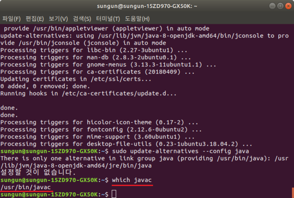
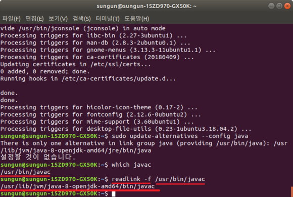
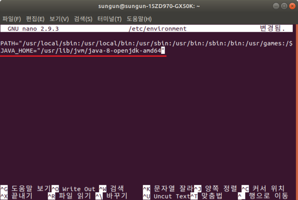
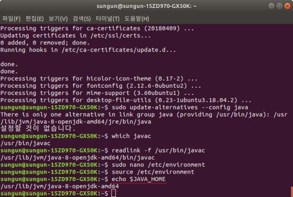

# `Ubuntu JDK 설치`  
   
## `List`  
- JAVA 설치 확인
- apt 업데이트
- JAVA 설치
    - default-jdk
    - openjdk-8-jdk
    - Oracle JDK
- JAVA 버전 관리
- JAVA 환경변수 설정을 위한 위치 확인
- JAVA 환경변수 지정

---

>## `JAVA 설치 확인`

`$ java -version`

---
>## `apt 업데이트`

`$ sudo apt-get update`

---

>## `JAVA 설치`

- ## default-jdk

기본 제공하는 버전의 JDK를 설치하게 됩니다.

`$ sudo apt-get install default-jdk`

`$ sudo apt-get install default-jre (jre만을 원한다면)`

- ## openjdk-8-jdk

`$ sudo apt-get install openjdk-8-jdk`

`$ sudo apt-get install openjdk-8-jre (jre만을 원한다면)
`
- ## Oracle JDK

  ### 1. PPA를 추가한다.
  `$ sudo add-apt-repository ppa:webupd8team/java`
 
  ### 2. apt 업데이트를 진행한다.
  `$ sudo apt-get update`
 
  ### 3. Java8 을 설치한다.
  `$ sudo apt-get install oracle-java8-installer`
 
  ### 4. 설치가 끝나면 정상적으로 설치되었는지 버전을 체크해본다.
  `javac -version`  

  `java -version`
 
  ### 5. Java 환경변수 설정을 자동으로 해주는 것을 설치한다.
  `sudo apt-get install oracle-java8-set-default`

---

>## `JAVA  버전 관리`
만약 여러 종류의 JAVA가 설치되어 있다면, 아래 명령을 통해 Default JAVA를 선택할 수 있습니다.  
`$ sudo update-alternatives --config java`

---

>## `JAVA 환경변수 설정을 위한 위치 확인`

`$ which javac`

`$ readlink -f /usr/bin/javac`  
/usr/bin/javac에 위의 경로 입력

---

>## `JAVA 환경변수 지정`

환경변수를 지정하기 위해, Path를 알아야 합니다.

JAVA관리를 위한 명령어를 통하면, 각 JAVA들의 path를 확인할 수 있습니다.

예를 들어, /usr/lib/jvm/java-8-openjdk-amd64 라는 Path를 확인하여, environment 에 아래와 같이 추가해줍니다.

`$ sudo nano /etc/environment`

`JAVA_HOME="JDK 경로 입력"`   
경로는 전단계 위치확인에서 알 수 있다.

`JAVA_HOME="/usr/lib/jvm/java-8-openjdk-amd64"`

저장을 하고 나서, 아래 명령어로 적용을 해주면 됩니다.

`$ source /etc/environment`

PATH가 제대로 지정되었는지 확인하기 위해서는 아래 명령을 사용합니다.

`$ echo $JAVA_HOME`

완료 되었습니다. ~!!!!

---
 

   