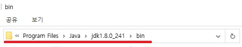
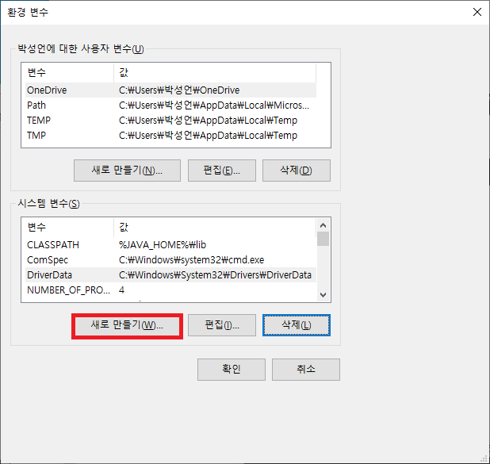
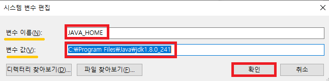

# `Window JDK 설치`  
   
## `List`  
- JAVA설치확인
    - OpenJDK
    - OracleJDK
- JAVA JDK 설치
- JAVA 환경 변수 설정
- JAVA 설치 확인해보기  

---

>## `JAVA JDK 설치확인`

윈도우 key + R 을 눌러줍니다.    

그리고 cmd 를 입력하여 명령프롬프트 창을 열어주세요.    

`java -version`    
`javac -version`    

위 명령을 입력하여, 자바 설치 여부를 확인합니다.    

---

>## `JAVA JDK 설치`

- ## OpenJDK

OpenJDK 설치 같은 경우는 다른 곳 을 참조하여 설치를 진행합니다.  

https://recipes4dev.tistory.com/173  
​
 

- ## OracleJDK 설치하기
  
https://www.oracle.com/java/technologies/javase-downloads.html  

​

위에 링크로 들어가서 원하는 버전의 설치 파일을 다운로드합니다.     
그리고 파일을 실행하거, 압축파일인 경우 압축을 풀고 해당 파일을 실행합니다.  

  

next를 누르면 이런 창이 뜨는데 java 의 설치 경로를 알아보기 위해 Change 버튼을 누릅니다.    

    

해당 경로를 복사하거나, 확인해 준뒤, ok 를 클릭하고 next로 넘어가면 jdk 설치가 실행 됩니다.  

---

>## `JAVA 환경 변수 설정`

  
  
  

마지막에 bin 폴더의 경로를 복사해 줍니다.    

  

이제 환경 변수를 설정하러 갑니다.  

  

환경 변수를 클릭합니다.  

  

user에 대한 사용자 변수에 있는 path를 편집합니다.  

  

새로 만들기를 클릭후 복사한 경로를 붙여 넣어줍니다.  

마지막으로 확인을 누르면 환경 변수의 설정이 끝났습니다.  

---

>## `JAVA 설치 확인해보기`

설치확인과 마찬가지로 윈도우 key + R 을 눌러 cmd를 실행시켜 줍니다.  

  

`java -version`

`javac -version`  

두 명령어를 입력후 버전이 나오면, 성공적으로 설치가 완료 되었음을 알 수 있습니다.  

설치 끝 !  

---

 

   