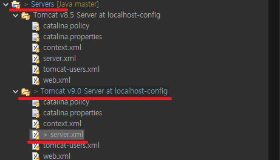
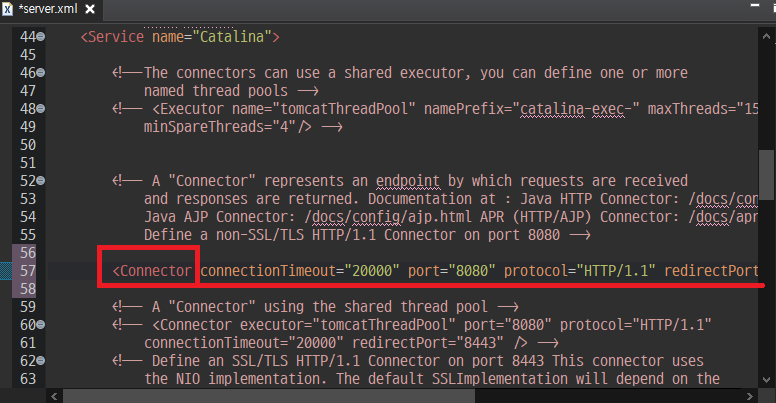
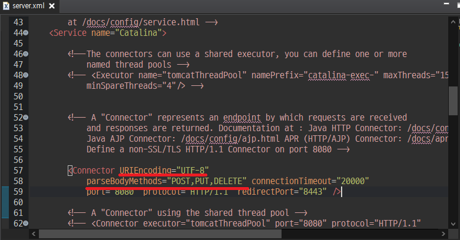

# REST API

모든 전제는 jackson lib 가 injection 되어있다는 가정하에 글 을 작성합니다.

> ### Bean 을 사용한 설정(spring boot)

STS19*REST_SpringBoot*(POST,PUT,DELE)\_TomcatSetting 참고

먼저 spring 설정을 직접적으로 건들여 주는 것은 이유는 아직 모르겟으나, spring에서는  
mapping 이 안되고 spring boot 는 boot-starter 로 인하여, mapping이 되는듯하여,  
boot 에서 사용하는 방법을 올리고자 합니다.

```
  @Bean
    public TomcatConnectorCustomizer tomcatConnectorCustomizer() {
        return new TomcatConnectorCustomizer() {
            @Override
            public void customize(Connector connector) {
                connector.setParseBodyMethods("POST,PUT,DELETE");
            }
        };
    }
```

TomcatConnectorCustomizer 객체를 이용하여 서버설정을 spring에게 알려줄수 있습니다.

---

> ### spring 에서의 톰캣 설정

STS19_REST_TomcatSetting 참고

POST PUT DELETE 와 같은 메소드로 서버에 BODY 를 보낼때,  
에러가 나게 되는데, 이는 톰캣 에러 입니다.  
톰캣의 내부적인 보안상 GET메소드 외에 모든 메소드의 접근을 막고 있습니다.(Spring...)  
(spring boot 에서는 boot 가 내부적으로 톰캣설정을 건들어 설정없이 사용 할 수 있습니다..)  
이를 해결 하기 위해 톰캣 서버 설정을 해야 합니다.  
  
톰캣을 사용 한다면, workspace 내부에 Server 라는 폴더가 생기게 됩니다.  
저는 현재 9버전을 이용중인 상태로 9버전의 설정폴더에서  
server.xml 로 진입합니다.

  
Connector 태그로 감싸져 있는 설정을 아래와 같이 수정합니다.



```
URIEncoding="UTF-8"
parseBodyMethods="POST,PUT,DELETE"
```

더 받고싶은 메소드가 있다면... 뒤에 계속 추가 하면됩니다.

---

> ### 톰캣 서버 설정없이 Body 받기 (HttpServlerRequest 활용)

STS19_REST_NOT Tomcat_USE HttpRequest 참고

HttpServletRequest 바디에있는 JSON 문자열을 Stream을 사용하여 뽑아내어 사용합니다.

```
@GetMapping
	public ResponseEntity<Result> get(HttpServletRequest request) {

		UserDTO dto = null;

		try {
			request.setCharacterEncoding("UTF-8"); // 인코딩 설정

			BufferedReader bufferedReader = new BufferedReader(
					new InputStreamReader(request.getInputStream(), "UTF-8"));

			String str = null;
			StringBuffer json = new StringBuffer();

			// json 형태의 body를 stream을 통하여 빨아냅니다.
			while ((str = bufferedReader.readLine()) != null) {
				json.append(str);
				log.info("현재 들어온 json : {}", str);
			}

			log.info("최종 JSON 결과물 : {}", json.toString());

			// jackson 라이브러리의 ObjectMapper객체를 통하여
			// 최종결과물 json을 해당 컬럼이 존재하는 객체에 자동주입
			ObjectMapper mapper = new ObjectMapper();
			dto = mapper.readValue(json.toString(), UserDTO.class);
			// json 을 read 읽어들여 해당 name이 일치하는 해당 객체(UserDTO.class)의
			// 맴버 변수에 자동주입

			log.info("자동주입된 UserDTO 결과물 : {}", dto);

			bufferedReader.close();
		} catch (Exception e) {
			e.printStackTrace();
			log.error("에러발생: {}", e.getMessage());
			return new ResponseEntity<Result>(HttpStatus.NOT_FOUND);
		}

		Result result = new Result();
		result.setStatus("OK");
		result.setMessage("반환 성공");
		result.setDto(dto);

		return new ResponseEntity<Result>(result, HttpStatus.OK);

	}
```
