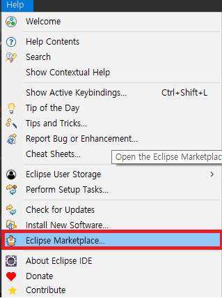
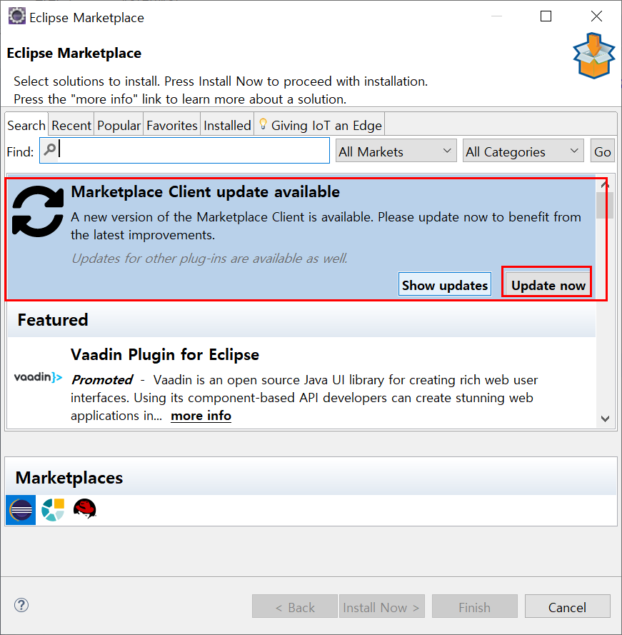
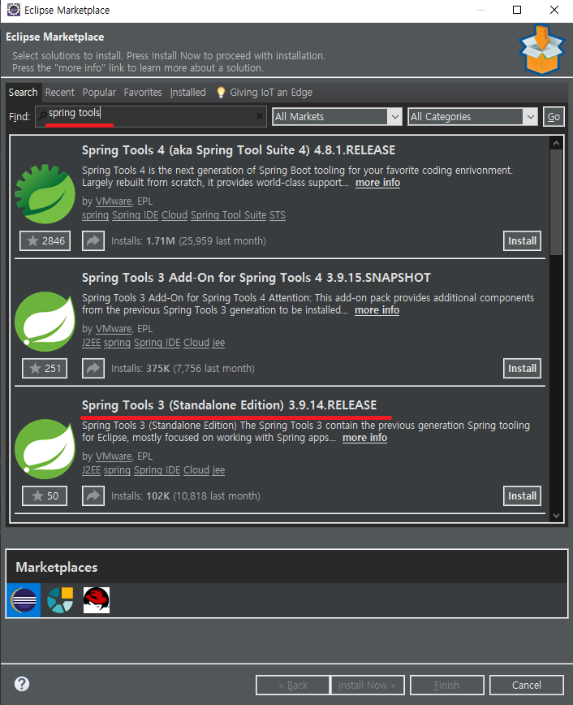
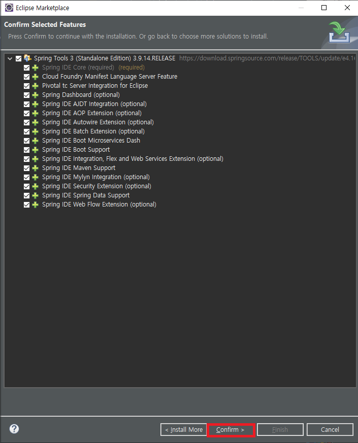
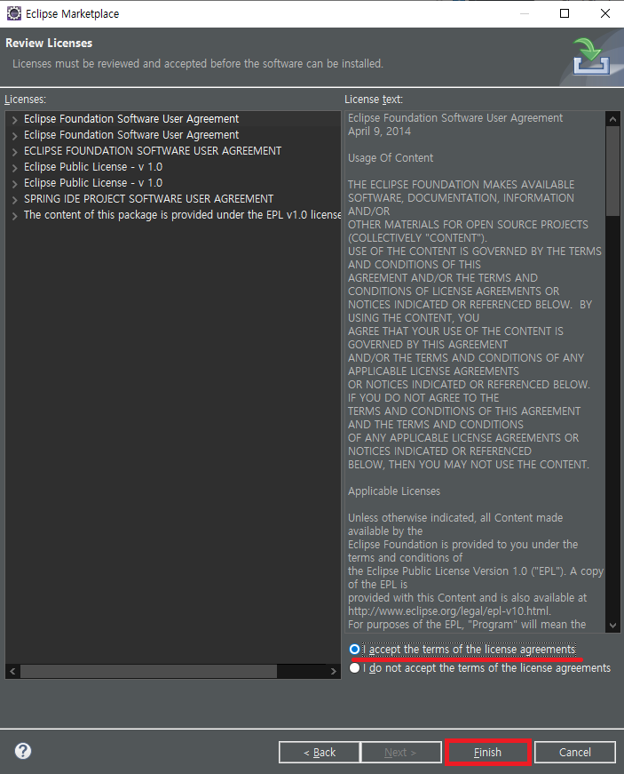
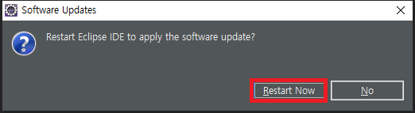
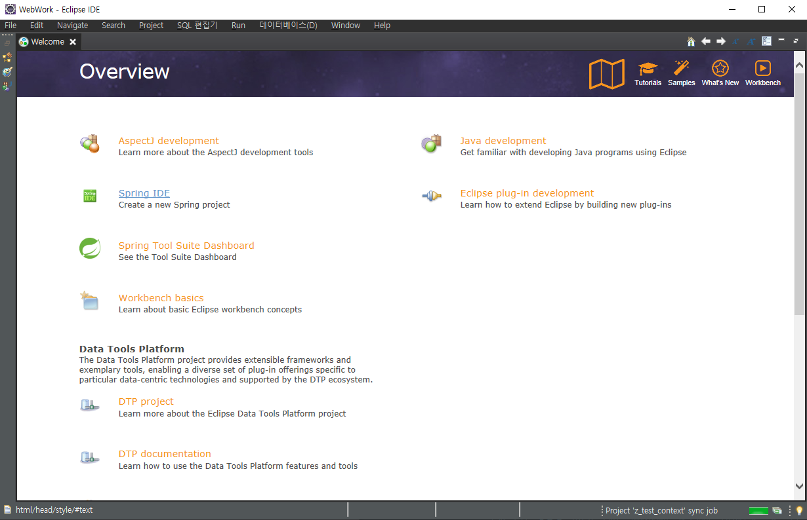
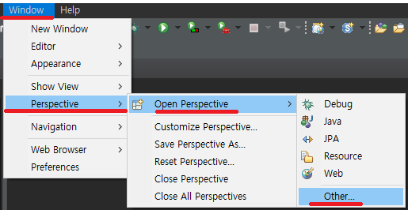
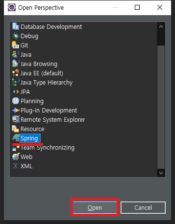
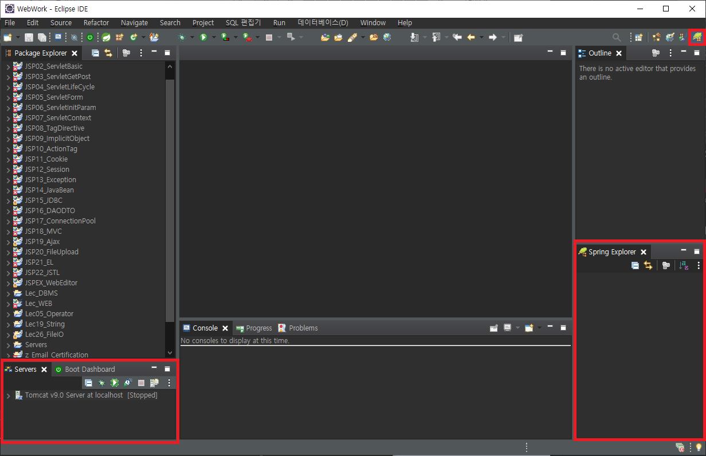

# `Spring`

## 사전 설치 및 세팅

스프링 5.x : JDK 1.8 이상 필요  
스프링 4.x : JDK 1.6 이상 필요  
스프링 3.x : JDK 1.5 이상 필요

---

## STS (Spring Tool Suite) 설치

이클립스에서 Spring 프레임 워크 개발을 위해서는 STS 를 설치 해야 합니다.  
  
Eclipse 의 Marketplace를 열어 줍니다.

Marketplace를 업데이트 해야 한다면 Marketplace 부터 업데이트 할 수 있도록 합니다.

  
현재 4.x 버전까지 나왔지만, 강의에서 배운 3.x 버전의 tools를 설치하겠습니다.

  
설정은 그대로 두 쉰뒤, confirm 으로 다음단계로 갈 수 있도록 합니다.

  
동의를 하여 설치를 종료 할 수 있도록 합니다.

  
이클립스의 우측 하단에서 설치가 진행됨을 알 수 있습니다.

  
  
재시작을 한뒤, Welecome 페이지가 나왔다면 성공적인설치!

  
window => Open Perspective => Other

  
Spring

사진과 같이 모든 메뉴들과 탭이 나왔다면 설정 끝!!
