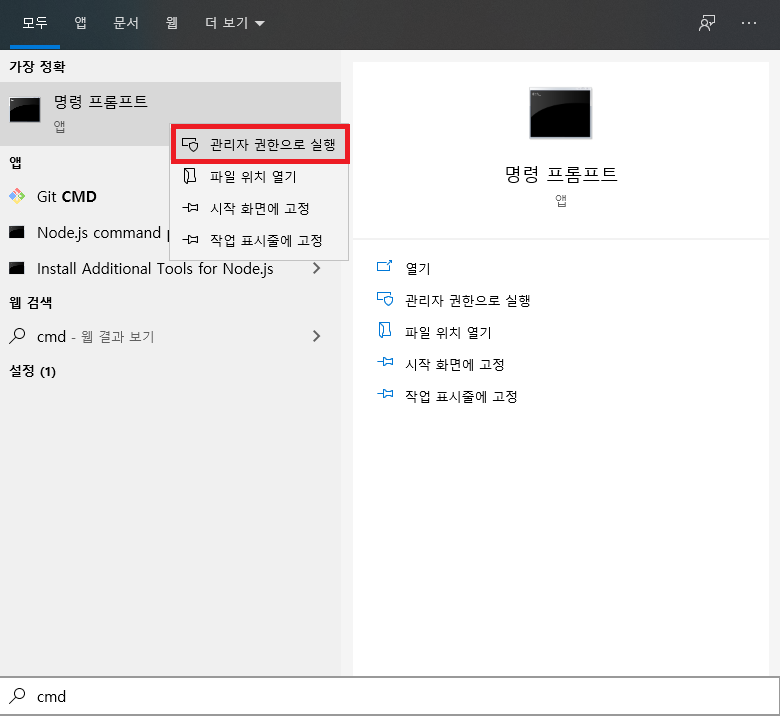
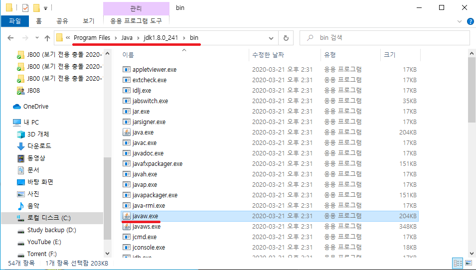

# `Spring`

## Lombok 설치

[Project Lombok 공식 사이트](https://projectlombok.org/)  
[Project Lombok 다운로드 바로가기](https://projectlombok.org/download)

  
롬복 라이브러리를 다운 받을 수 있도록 합니다.

  
다운로드 받은 경로를 기억하도록 합니다.

  
cmd 를 관리자 권한으로 실행 하도록합니다.

  
cd change directory 를 사용하여 lombok 라이브러리가 있는 곳으로 이동합니다.

```
java -jar lombok.jar
```

명령어로 jar 파일을 실행합니다. (더블클릭으로 실행하여도 똑같습니다.)


  
이클립스의 설정파일에 경로를 넣어주어야 하므로 jdk의 경로를 복사합니다.


  
안정적인 가동을 위해

```
-vm
C:\Program Files\Java\jdk1.8.0_241\bin\javaw.exe
```

를 추가 할수 있도록합니다.
